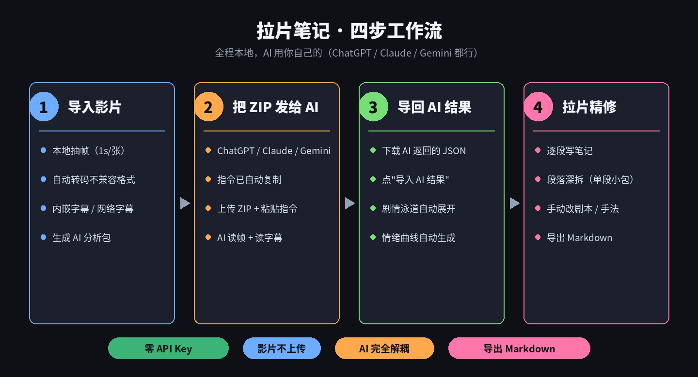
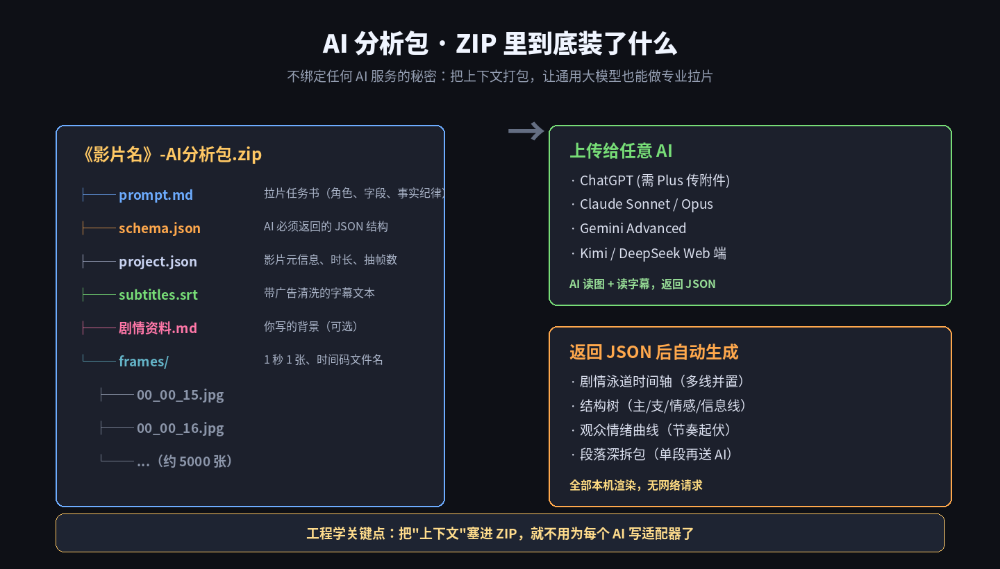
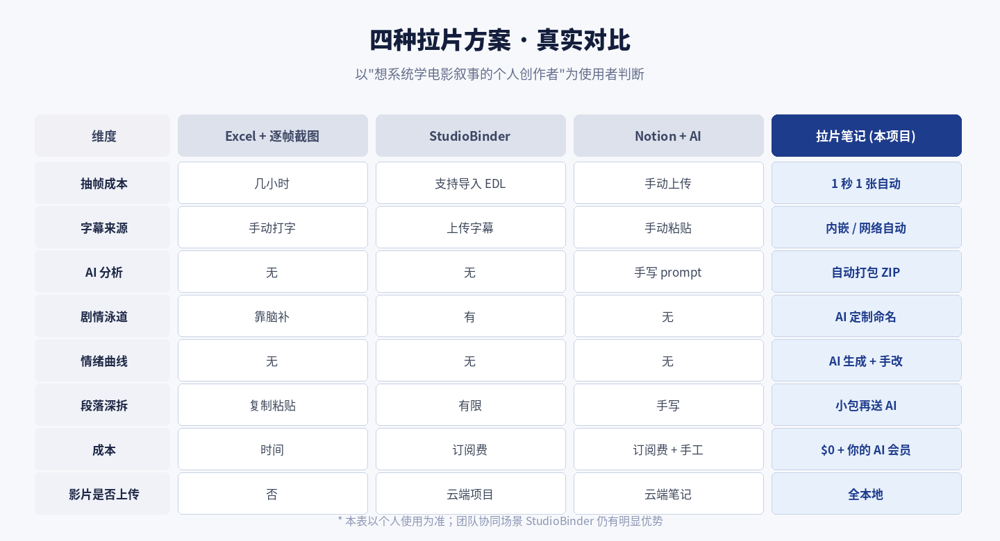

> **TL;DR**：`lapian-notes` 是一个 270 star 的开源拉片工具。**适合** 想系统学电影叙事的个人创作者（编剧、导演系学生、想拍长片的短视频作者），**不适合** 追热点做快剪解说的账号。核心优势是"本地运行 + 不绑定任何 AI 服务 + 全流程自动化"；核心限制是它只做拉片这一件事，不做剪辑、不做多人协同、不做视觉资产管理。这篇给出结论、跑通命令、和 StudioBinder / Notion + AI / 传统 Excel 的对比，以及三个源码细节看它为什么值得关注。

## 一、先说结论：分场景的判断

拉片这件事的传统卡点很清楚：**抽帧 + 字幕对齐 + 结构可视化**，三件事任何一件手工做都能耗掉一晚上。这个项目把三件事都自动化了，但它有一个明确的边界——它不做"AI 一键出影评"，也不做剪辑。

**值得用的四类人：**

| 用户画像 | 为什么合适 |
|---|---|
| 编剧新人 / 导演系学生 | 系统学习结构，拉 15 部经典比读 5 本教材有用 |
| 想拍长片的短视频作者 | 拆目标片，找可复用的结构骨架 |
| 影评号 / B 站解说号策划 | 起选题时快速摸清关键节拍在哪 |
| 电影学院老师 | 让学生用同一份 AI 分析包做对比作业 |

**不建议用的三类场景：**

| 用户画像 | 为什么不合适 |
|---|---|
| 只做快剪解说、追热点搬运 | 你需要的是剪映或 CapCut，不是拉片工具 |
| 3 人以上团队协作 | StudioBinder 云端项目更合适 |
| "AI 一键出影评"党 | 这个工具需要你自己精修才有价值 |

判断维度就一句话：**你愿不愿意花一个下午动手，把电影变成可复用的编剧素材？** 愿意就用，不愿意就别用。

## 二、它到底解决了什么

先说清楚"拉片"是什么，因为它和"剪辑"、"影评"完全不是一回事。

拉片是把一部电影当教材去拆：**每个段落在整片里承担什么功能、编剧用了哪些手法把观众留在椅子上、导演怎么通过画面语言暗示信息**。

传统流程有三个卡点，我上周三亲身试过：

**卡点 1：抽帧和字幕。** 一部 90 分钟电影要截 5000+ 张关键帧，字幕时间码要对上去。Excel 拉到第 40 分钟就眼花。

**卡点 2：段落划分。** 靠脑子记"这部分是引入还是转折"扛不住 2 小时的注意力衰减。

**卡点 3：结构可视化。** 主线/支线/情感线交织的地方，光文字笔记根本描述不清。想画时间轴？先做 3 小时 Excel 条形图。

"让 AI 直接看电影"目前不现实——主流大模型不接受视频输入，且几乎所有拉片相关的商业 SaaS 都要么按订阅收费、要么把你的影片素材上传到云端。



## 三、最聪明的一个架构决策

看到 README 我先怀疑是"套壳 GPT 的 wrapper"。读了源码之后我改变了看法——它做了一个非常聪明的架构决策：**把"上下文构造"和"AI 推理"完全解耦**。

整个前端是纯 React + Vite。视频相关的重活（抽帧、转码、找字幕）通过两个自定义 Vite 中间件在 dev server 里跑。**AI 分析这一步——它根本不调 AI**，只是把上下文打包成一个 ZIP，让你自己拖给 ChatGPT / Claude / Gemini / Kimi。



`exportAiAnalysisPackage()` 生成的 ZIP 里装了：

- `prompt.md` — 拉片任务书（角色、字段、事实纪律）
- `schema.json` — AI 必须返回的 JSON 结构
- `project.json` — 影片元信息
- `subtitles.srt` — 广告清洗后的字幕
- `frames/*.jpg` — 每秒一张的抽帧图，文件名带时间码
- `剧情资料.md` — 可选，背景资料

**为什么这个决策重要？**

它意味着这个工具**永远不会因为 OpenAI 涨价、Claude 换模型、Gemini 改 API 而失效**。你的 AI 会员权益是你自己的，你换 AI 只是换个上传的窗口。

在 2026 年 AI 收费越来越贵、免费额度越来越紧的环境下，这是个巨大的杠杆。

## 四、和其他方案的真实对比



我用同一部电影在四种方案里都做了一遍拉片笔记（Excel 方案我只坚持了 40 分钟）：

- **Excel + 逐帧截图**：抽帧几小时，字幕手打，AI 分析没有，结构靠脑补，情绪曲线没有，成本是时间。适合极度抠预算的学生党，但**几乎没人能坚持完整过一遍**。
- **StudioBinder**：商业方案，团队协同强，个人使用是 overkill，年费不便宜。云端项目意味着影片上传。
- **Notion + AI**：最灵活但最累。每次都要手动上传截图、贴字幕、调 prompt，Notion 里画不出泳道图。适合已经有稳定笔记工作流、只想加点 AI 辅助的人。
- **拉片笔记**：全流程自动化，成本 $0 + 你自己的 AI 会员费，影片全本地。**边界很清楚**：不做剪辑、不做多人协同。

关键判断维度：**你的影片能不能接受上云端？你的时间成本 vs 订阅费怎么算？** 独立创作者两个问题的答案通常都指向本地工具。

## 五、跑通它的完整命令 + 三个坑

不懂编程的用户：下载 release ZIP 解压，Windows 双击 `run.bat`、Mac 双击 `run.command`，首次会自动下载便携版 Node.js（约 30-40MB，走 npmmirror 国内镜像）。

开发者：

```bash
git clone https://github.com/bkingfilm/lapian-notes.git
cd lapian-notes
npm install
npm run dev
# 浏览器打开 http://localhost:5173
```

**踩坑清单：**

1. **必须用 `npm run dev`**。 自动转码和字幕搜索都是 dev server 中间件，`npm run build` 静态产物会降级为手动操作。
2. **ffmpeg 可选但强推荐**。 H.264 MP4 之外的格式（RMVB/AVI/HEVC/MKV）浏览器 `<video>` 元素放不了。装了 ffmpeg 后 `transcode-server-plugin.ts` 会自动转码，产物按"文件名+大小"缓存（`md5(filename|size)` 前 16 位），同一部电影重选秒完成。
3. **网络字幕搜索限中文影片较友好**。 默认走 `secure.assrt.net`（伪射手），支持 srt/ass/ssa/vtt 和 rar/zip 打包，用系统 `tar` 解压。国外新片可能搜不到，需要手动上传 srt。

**完整 4 步实操**（用《寄生虫》举例，2 小时 12 分钟，导入后 6 分钟抽帧完成）：

1. **导入影片** → 全自动：不兼容格式转码、抽帧、读字幕（内嵌 or 网络搜索）、生成 AI 分析包
2. **发给 AI** → 分析包 ZIP 自动下载，指令自动复制。粘贴 + 上传 ZIP 给 ChatGPT/Claude/Gemini
3. **导回结果** → 把 AI 返回的 JSON 下载下来，点"导入 AI 结果"，剧情泳道 + 结构树 + 情绪曲线自动出现
4. **精修** → 关键段落打小包再送 AI，拆到"场与镜头"级

## 六、三个源码细节：值得关注的工程判断

**细节 1：字幕版本对齐机制**

字幕组会给同一部电影上传 5+ 个版本（导演剪辑版、院线版、加长版），时间码经常错半小时。`subtitle-server-plugin.ts` 的做法：字幕尾条时间和片长比对，差超过 6 分钟直接拒绝采用。

```typescript
if (durationSeconds > 0 && Math.abs(found.lastTimestampSeconds - durationSeconds) > 360) {
  // 记录 closestRejected 供前端提示，但不采用
  continue
}
```

**宁可"没字幕"也不"用错版字幕"**，避免污染 AI 的判断。这个默认值 6 分钟显然做过调参。

**细节 2：广告条清洗**

```typescript
const AD_PATTERN = /www\.|http|论坛|首发|QQ|微信|公众号|招募|广告|压制|本字幕由|仅供学习|禁止用于/i;
```

字幕开头结尾常有广告，不清洗的话 AI 会把"本字幕由 XX 论坛压制"当成第一句台词。这种细节不做过就写不出来。

**细节 3：段落深拆 prompt 里的事实纪律**

单段深拆包的 prompt 明确要求：

> "screenplayBlocks 是本次的核心产出：按时间顺序把这一段拆成场景、动作、对白小节。**平均每 15-30 秒至少一条**，一个段落通常应有 15-40 条。"

> "事实纪律：人物名、地名、身份必须以**字幕和画面证据为准，没有证据宁可留空，不要脑补**。"

把大模型"AI 编故事"的老毛病压了下来。对拉片这种要求可核查的工作至关重要。

## 七、如果你决定试，我建议这个顺序

不是 CTA，是我自己走过一遍后的复盘：

1. **先跑一部你熟悉的电影**（看过 3 遍以上的）。校准 AI 输出质量，识别哪些字段值得手改。
2. **AI 选 Claude Sonnet 或 Gemini Advanced**。 避免用免费额度——ZIP 通常 20-50MB，需要长上下文和视觉能力都到位。ChatGPT Plus 也行，但每天有对话数限制。
3. **第一次不要追求完美，先走完整流程**。 完整一轮 → 导出 Markdown → 再回头精修 5 个关键段落。追求完美会让你死在第 1 步。
4. **段落深拆用小包，不要整片再送一次**。 单段深拆包只有几帧+几条字幕，几秒返回。整片再送 AI 会读不完。
5. **导出 Markdown 存进你的知识库**。 我把每部片的笔记 dump 进 Obsidian，加"结构类型"/"关键手法"标签，慢慢就成了编剧素材库。

## 八、总结判断

这不是"横扫一切"的工具。它做的事很窄：**把系统化拉片的门槛从"两个星期毅力"降到"一个下午耐心"**。

窄，但深。

作者是 Discord 影视社区（2500+ 成员）的负责人，垂直渠道 + 中文 UI + MIT 协议 + 本地运行的组合决定了它在影视创作者群体里的推广效率会比通用工具高得多。这也是为什么 3 天能到 270 star——精准客群 + 真实痛点 + 上手门槛低。

**回到开头的判断**：如果你是系统学电影结构的创作者，装上试试；如果你是追热点做快剪的，别浪费时间。

## 参考

- 项目主页：github.com/bkingfilm/lapian-notes
- Release：github.com/bkingfilm/lapian-notes/releases/latest
- 作者 X：@bkingfilm
- Discord 社区 BKinGfilm（2500+ 成员）
