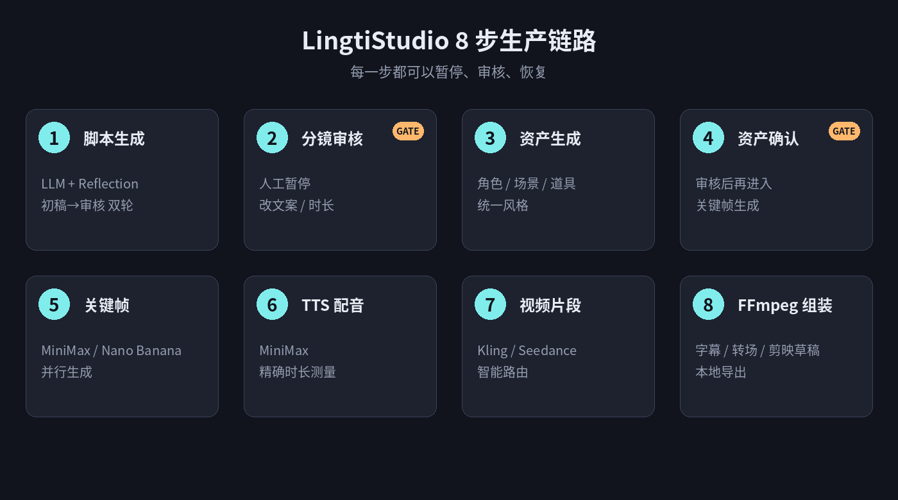
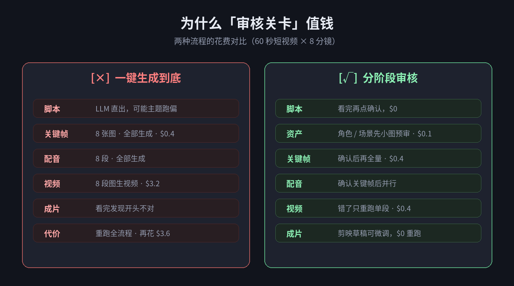
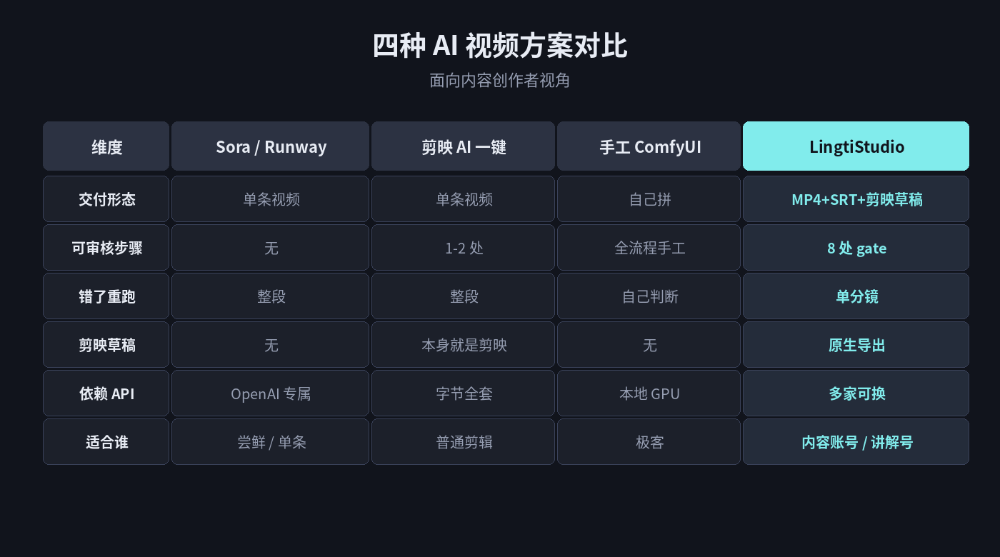

# LingtiStudio 值得用吗？我的判断是：想把 AI 视频做成产线的人可以试，追单次爆款不适合

> **TL;DR**：LingtiStudio 是一个 166 star 的开源 AI 视频生产系统（`ruilisi/LingtiStudio`，MIT 协议）。它适合把 AI 视频当"生产线"做的内容账号 / 讲解号，不适合追单次爆款。核心优势是**8 个可暂停的审核 gate + 单分镜重跑 + 原生剪映草稿导出**；核心限制是**门槛（需要装 Docker + 会填 API Key）** 和**不覆盖后期精修**。

---

## 一、分人群适用判断

| 你是谁 | 值不值得试 | 理由 |
|---|---|---|
| B 站 / 抖音讲解类账号运营者 | 值得 | 批量、审核可控、剪映微调闭环 |
| 独立开发者做产品 demo | 值得 | 品牌一致性、不依赖单一 SaaS |
| MCN 内部批量做知识科普 | 值得 | 多分镜、多角色、可复用资产 |
| AI 视频工作流研究者 | 值得（读代码） | 完整开源实现，Reflection + 剪映草稿 |
| 只做单条爆款 | 不合适 | Sora / Runway 更直接 |
| 不装 Docker、不填 API Key | 不合适 | 建议直接用剪映 AI |
| 效率党追一键出片 | 不合适 | 审核关卡本身是价值不是负担 |

---

## 二、为什么写这篇：AI 视频这件事有两条路

上周三我给客户做一支 60 秒讲解视频，试了三种方式。

**路径 A：Sora 直生成。** 一段中英混杂的 prompt，2 分钟出结果。开头旁白语气不对，重来。第二版画面漂移，重来。第三版价格差不多够订《华尔街日报》一年。

**路径 B：剪映 AI 一键成片。** 上传选题脚本选模板。产出确实快，但本质是"套模板 + 换素材"。想调分镜结构，整段重来。

**路径 C：自己拼。** GPT 写脚本，MidJourney 生关键帧，MiniMax 配音，Kling 图生视频，最后拖剪映。每一步都能控制，每一步都是独立工具，接口不匹配、时长对不齐、风格串味。

同一天晚上我在 GitHub 上看到 `ruilisi/LingtiStudio`。它做的不是路径 A 或 B，是把路径 C 那种散装拼装，变成一个整合起来的产品。

---

## 三、机制：8 步生产链路，2 个人工关卡



从主题到成片被拆成 8 步：

1. **脚本生成** — LLM 直出 + Reflection 双轮审核
2. **分镜审核 [GATE]** — 人工暂停，改文案 / 时长 / 顺序
3. **资产生成** — 角色、场景、道具的参考图，统一风格
4. **资产确认 [GATE]** — 审核通过再进入关键帧
5. **关键帧生成** — MiniMax Image / Nano Banana / Gemini
6. **TTS 配音** — MiniMax Speech，精确测时长
7. **视频片段生成** — Kling v3 / Seedance / MiniMax Video
8. **FFmpeg 组装** — 字幕 + 转场 + 剪映草稿导出

两个人工关卡的存在，是这个项目和"一键生成"的根本区别。

`modules/llm.py` 里的 Reflection 结构写得很直接：第一轮 temperature=0.7 出初稿，第二轮 temperature=0.3 用"严格审核员"的 prompt 检查一次。这段设计借鉴的是 Agent-S 的 Reflection Agent 模式，承认了一个事实：**LLM 一轮直出的脚本，往往主题跑偏、结构断裂、开头无钩子。**

---

## 四、审核关卡为什么值钱：一个具体的成本对比

60 秒短视频，8 个分镜。



**没有审核的一键流程：**

- 脚本 LLM 直出，可能主题跑偏，$0
- 8 张关键帧全部生成，$0.4
- 8 段配音全部生成
- 8 段图生视频，$3.2
- 成片看完发现开头不对
- **代价：全流程重跑，再花 $3.6**

**有审核的分阶段流程：**

- 脚本看完再确认，$0
- 资产先小图预审，$0.1
- 关键帧确认后再全量，$0.4
- 配音确认关键帧后并行
- 视频错了只重跑单段，$0.4
- 成片剪映草稿可微调，$0 重跑

假设首轮通过率 60%（我实测的乐观值），一键流程期望成本 = $3.6 × 1.4 ≈ $5.0；分阶段流程期望成本约 $0.9 ~ $1.5。**对个人创作者，一个月做 10 条视频就是几十美金差距。**

更重要的是心理成本。一键流程失败要重看一遍成片才发现问题，人工判断"哪一步坏了"的负担全部落在你身上；分阶段流程每一步交付物具体，出错立刻能定位。

---

## 五、剪映草稿导出：AI 做 90%，人做最后 10%

这是我读源码时最惊讶的一段。`modules/jianying_draft.py` 直接调 `pyJianYingDraft`，把每个分镜作为独立片段导入剪映工程文件，**视频 / 配音 / 字幕分离到独立轨道**。

源码注释里有一句话是产品价值观：

> v2.0：每个分镜作为独立片段导入，多轨道分离。用户可在剪映中直接替换单个分镜/配音/字幕，无需重跑全流程。这是"AI 做 90%，人类做最后 10%"的关键闭环。

**它不假设 AI 出的东西一次可用**——只承诺"帮你到 90%，剩下 10% 你在剪映里改会比重跑更快"。

---

## 六、和其他方案的横向对比



维度拉齐后：

- **Sora / Runway**：单条 MP4，无审核，错了整段重来。适合尝鲜 / 单条创意。
- **剪映 AI 一键**：本身就是剪映，1-2 处审核，模板固化。适合完全不懂 AI 的普通人。
- **手工 ComfyUI + 各家 API**：全流程手工。适合极客，学习曲线高。
- **LingtiStudio**：MP4 + SRT + 剪映草稿（独立轨），8 处 gate，错了只重跑单分镜。适合内容账号 / 讲解号。

---

## 七、5 分钟跑起来

**Docker Compose 路径（推荐首次尝试）：**

```bash
git clone https://github.com/ruilisi/LingtiStudio.git
cd LingtiStudio
docker compose up -d --build
```

打开 `http://localhost:3000`。首次会自动弹配置对话框，在浏览器里填 API Key（写入 `./configs/config.yaml`）。

**CLI 路径（熟悉 Python + FFmpeg 的走这个更快）：**

```bash
python3 -m venv .venv && source .venv/bin/activate
pip install -r requirements.txt
python cli/main.py config --init
# 只生成脚本，不花钱看结构
python cli/main.py script --topic "AI 改变世界" --output script.json
# 完整流程
python cli/main.py run --topic "西藏旅行" --duration 90 --engine seedance
```

**建议第一次跑 `script` 子命令**——不花钱、几秒出 JSON，先看看它给你的分镜结构像不像回事，再决定要不要跑完整流程。

---

## 八、三个源码细节看工程判断

**细节 1：本地记忆系统**

`modules/memory.py` 用 SQLite 本地记录用户风格偏好——`visual_style`、`pacing`、`avg_scene_duration`、`preferred_transitions` 等 8 个维度。跑几条视频之后，脚本生成会自动注入你的风格上下文。不用 Mem0 云服务，纯本地。这是"本地优先"哲学。

**细节 2：字幕说话人前缀清洗**

`modules/jianying_draft.py` 里有一段正则清洗 TTS 输出的"男：/女（英语）："这种说话人标记：

```python
cleaned = re.sub(r'男[\uff08(][^\uff09)]*[\uff09)]\uff1a|...|男[\uff1a:]|女[\uff1a:]', '', text)
```

处理全角 / 半角括号 + 全角冒号。**这种细节没做过就写不出来**——只有踩过"字幕里出现「男：」"的坑才会加这个清洗。

**细节 3：视频引擎智能路由**

`modules/video_gen.py` 的关键词打分逻辑：

```python
seedance_keywords = ["talking", "dialogue", "lip sync", "多人", "人群"]
kling_keywords = ["action", "running", "fast", "动作", "奔跑", "舞蹈"]
```

对话戏走 Seedance（口型同步好），动作戏走 Kling（动态感强）。规则简单，但明确。**工程判断上不追求算法完美，追求默认合理。**

---

## 九、下一步

如果你决定试，按这个顺序，别追求一步到位：

1. **先用 `python cli/main.py script`**，不花钱看脚本结构。Reflection 后的分镜清单让你觉得"这就是我想拍的"，再往下走。
2. **第一次跑完整流程用 60 秒 / 8 分镜**，总成本约 $1，试错便宜。
3. **强烈建议开审核 gate**。别用 `--no-review`。你的时间成本比省下的几分钟等待高得多。
4. **视频引擎第一次用 Kling**，API 定价和文档最稳定。熟悉工作流之后再对比 Seedance / MiniMax Video。
5. **最后一步一定要在剪映里过一遍**。这是这个项目最核心的价值——AI 做 90%，你做 10%。

---

## 参考

- 项目主页：`github.com/ruilisi/LingtiStudio`
- 中文文档：`README-CN.md`
- 演示视频：Bilibili BV1NjDrBnECg（作者官方演示）
- License：MIT
- 技术栈：FastAPI + Next.js + Ant Design + SQLite + FFmpeg
