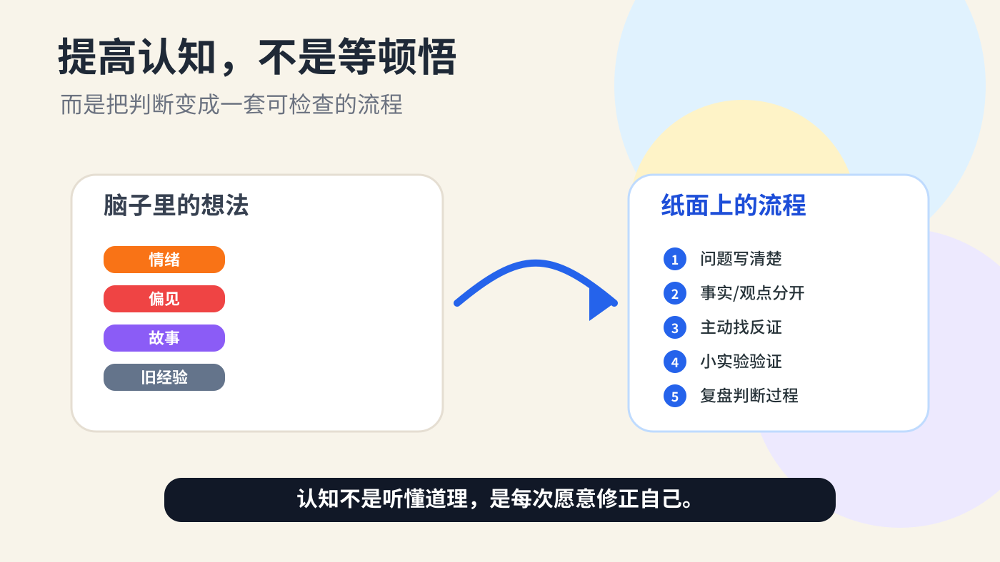
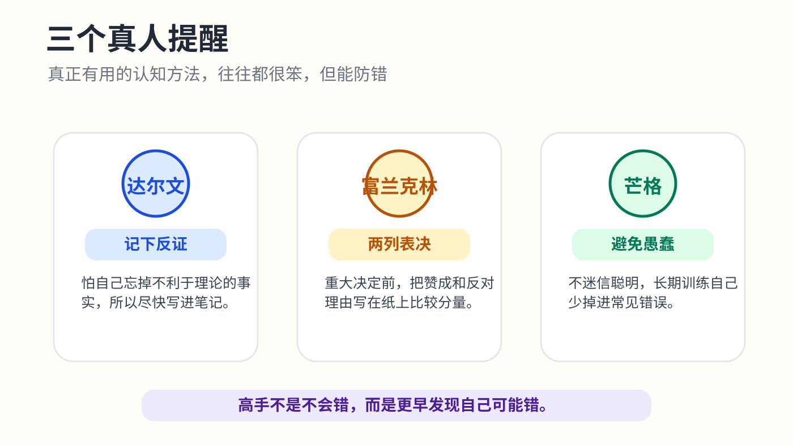

# 怎样提高自己的认知流程？

我后来才明白，认知这东西，最怕被说成玄学。

很多人一聊“提高认知”，就开始往高处飘：格局、底层逻辑、系统思维、长期主义。词都对，但你听完还是不知道明天早上该怎么做。我的理解更笨一点：认知不是脑子里突然亮了一盏灯，而是一套处理问题的流程。流程好一点，同样的信息进来，得出的判断就不容易跑偏。

先说一个真人例子。达尔文写《物种起源》之前，做了很多年的笔记。他有个习惯很值得学：凡是和自己理论相反的事实，他会尽快记下来。原因也很朴素，他知道人脑会自动保护自己喜欢的观点，过一阵子就会把反证忘掉。你看，这不是什么“天才灵感”，更像是一个防止自己骗自己的工作流。

富兰克林也有类似的笨办法。他做重大决定时，会把一张纸分成两列，一边写赞成，一边写反对，再给每条理由估个分量。这个方法今天看起来甚至有点土，但它解决了一个很常见的问题：人容易被当下情绪推着走，把“我想要”误认为“这件事值得做”。

芒格讲得更直接。他说自己一辈子都在避免愚蠢，而不是追求绝顶聪明。这个说法我很喜欢。因为普通人提高认知，真正有效的路径不是天天追求顿悟，而是少犯那些重复的错：信息没查清就下结论，听到一个故事就相信规律，遇到反对意见就急着反驳，赚钱了就觉得自己懂了，亏钱了就怪环境。

所以我建议把“提高认知”拆成一个很具体的流程。

第一步，先把问题写清楚。不是“我要不要换工作”这种大问题，而是写成“如果我现在换工作，未来一年最可能得到什么、失去什么、承担什么风险”。问题写不清，后面的分析基本都是自我安慰。很多人不是不会思考，是一开始就问错了问题。

第二步，把事实和观点分开。事实是“这个行业过去三年融资变少了”“我现在工资是多少”“目标岗位要求什么能力”。观点是“这个行业没前途”“我肯定能适应”“老板不重视我”。观点可以有，但别让它冒充事实。认知差距经常就藏在这里：高手会先整理证据，普通人先整理情绪。

第三步，主动找反证。你如果已经倾向于跳槽，就专门问：有什么证据说明我不该跳？你如果想投一个项目，就专门问：什么情况下它会失败？这一步很不舒服，因为它会打断兴奋感。但也正因为不舒服，它才值钱。达尔文记反证，本质上就是给大脑加了一个刹车。

第四步，用小实验代替空想。想转行，不一定马上辞职，可以先用两周做一个小项目、约三个人聊聊、投十份简历看看反馈。想做自媒体，不要先研究一年方法论，先连续写二十篇，看自己能不能扛住无人点赞的阶段。现实反馈比脑内推演诚实得多。

第五步，复盘时别只问“结果好不好”，要问“当初我是怎么判断的”。很多人复盘只看输赢，这会把人带歪。一次赚钱的决策可能是坏流程碰上好运，一次失败的决策也可能是好流程遇到小概率事件。真正要复盘的是：我当时用了哪些信息？漏掉了什么？有没有被面子、恐惧、贪心带节奏？下次遇到类似情况，我要改哪一步？

这套流程说白了就是：写清问题，区分事实和观点，找反证，做小实验，复盘判断过程。它不高级，但能用。

我自己越来越相信，认知高的人不一定知道更多答案，但他们更知道自己的答案可能错在哪里。他们不会把第一次想到的解释当真理，也不会因为别人反对就马上防御。他们愿意把判断摊开，接受现实检查，然后一点点改。

如果只能给一个建议，我会说：从今天开始，遇到重要问题，别只在脑子里想。拿一张纸，写下三个东西：我现在相信什么？我凭什么相信？什么证据会让我改变看法？

这三个问题坚持写一个月，比收藏一百篇“提高认知”的文章有用。认知不是听懂道理的瞬间提高的，是你每次愿意修正自己时，一点点长出来的。
