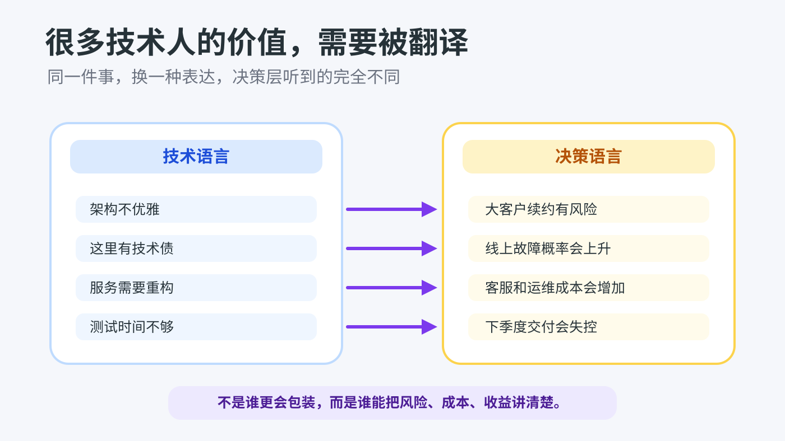
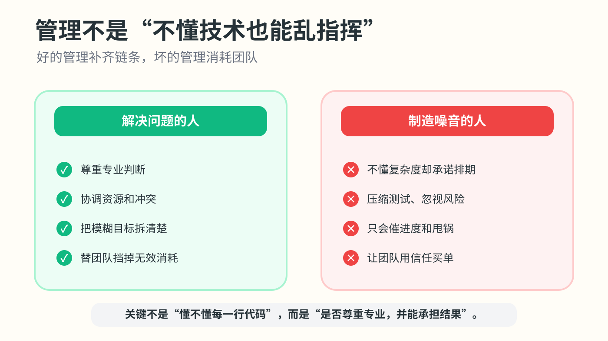

# 为什么有的人完全不懂技术，却可以做到管理层

我以前也很不服气。

尤其是在技术团队里，看到一个人连接口、数据库、线上故障都讲不清楚，却能坐在会议室里拍板、分资源、定优先级，第一反应很容易是：凭什么？我们加班写代码、排查问题、背锅上线，他不懂技术，怎么反而成了领导？

后来工作久了，我慢慢发现，这件事不能简单理解成“会拍马屁的人上去了”或者“技术人吃亏了”。这种情况当然有，有些管理者确实靠包装、站队、甩锅混到了位置上。但也有另一种更常见的现实：公司提拔一个人，不一定是因为他最懂技术，而是因为他能解决公司当下最痛的那类问题。

技术能力解决的是“怎么把东西做出来”。管理层更常被要求解决的是“做什么、先做什么、谁来做、资源从哪里来、做砸了谁负责”。这几件事听起来虚，其实一点都不虚。一个项目失败，原因未必是代码写不出来，更多时候是需求天天变、部门之间互相卡、老板目标不清楚、客户承诺压死人、研发人手不够、上线窗口没人拍板。这个时候，纯技术能力只能解决其中一段，不能解决整个链条。

所以有些不懂技术的人能上去，是因为他懂业务、懂人、懂组织规则。他知道客户真正要什么，知道老板最在意哪几个指标，也知道哪个部门不提前沟通就一定会拖后腿。他可能写不出一行代码，但能把销售、产品、研发、运营拉到一张桌子上，让事情往前走。对公司来说，这也是能力，而且是稀缺能力。

还有一个很残酷的事实：很多技术人并没有把自己的价值翻译成组织听得懂的语言。你说“这个架构不优雅”“这里有技术债”“服务需要重构”，在技术圈当然成立；但老板听到的可能只是“又要时间、又要人、又看不到收入”。如果另一个人能把同一件事讲成“这个问题不处理，下季度大客户续约会有风险，线上故障概率会上升，客服成本会增加”，那他就更容易被看见。不是他比你聪明，而是他说的是决策语言。

这也是我觉得技术人最委屈的地方。很多人不是能力差，而是太习惯把责任扛在自己身上。需求不清楚，先做；时间不够，熬夜；线上出事，先救；别人甩过来的锅，先接住。久而久之，公司会把你当成“可靠的执行者”，但不一定把你当成“能带方向的人”。你越能干，越容易被锁在一线，因为所有人都知道：这个活离了你不行。

当然，这不代表管理者可以不懂技术。完全不懂技术还乱指挥，是灾难。最怕的是他不知道复杂度，却承诺排期；不知道风险，却压缩测试；不知道系统边界，却让团队硬改。这样的管理者短期可能看起来很强势，长期一定消耗团队信任。技术团队不是靠口号跑起来的，专业判断必须被尊重。

但反过来说，技术人如果想走向管理，也不能只停留在“我技术比他强，所以我应该上”。管理岗位要的是另一套能力：判断取舍，沟通冲突，识别人的状态，承担不确定性，把模糊目标拆成可执行的路径。你要能听懂技术，也要能讲给非技术的人听；你要保护团队，也要理解公司为什么焦虑。

我现在更愿意把这件事看成一个提醒：职场不是考试，分数最高的人不一定当班长。公司看的是谁能在更大的范围里产生影响。技术是很硬的本事，但如果它只停留在屏幕前，就容易被低估。真正厉害的技术人，最好既能钻进代码里，也能从代码里抬起头，看见业务、看见人、看见利益关系。

所以，看到不懂技术的人做了管理层，先别急着骂，也别急着自我怀疑。可以观察两件事：他到底是在解决问题，还是只是在制造噪音；自己到底是想继续做更强的专家，还是也想学习影响组织的能力。前者决定你要不要服他，后者决定你以后会不会一直被别人管理。
