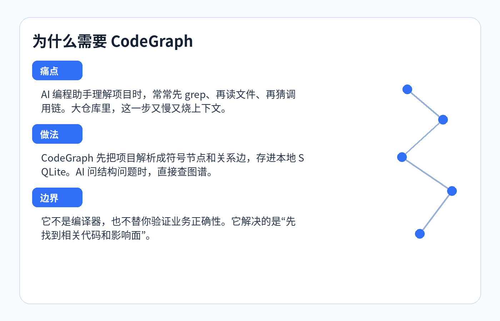
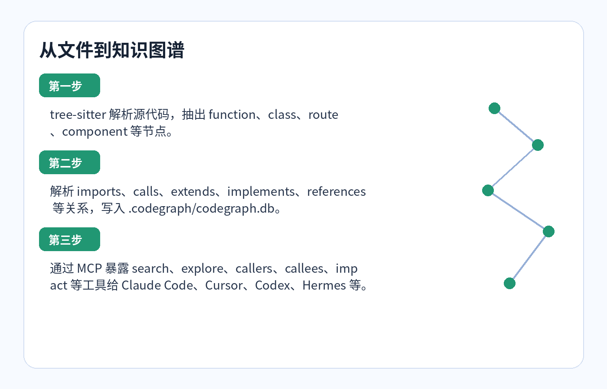
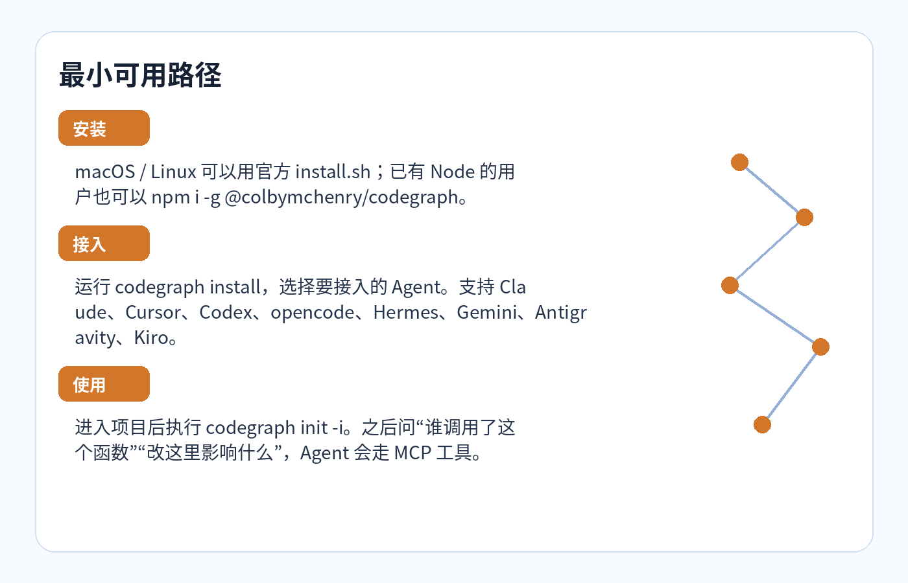

# CodeGraph：给 AI 编程助手装一个本地代码大脑



我越来越觉得，AI 编程助手最浪费时间的地方，不是写代码，而是找代码。

你问它“这个登录流程怎么走”“改这个函数会影响哪里”，它经常先 `grep` 一轮，再打开几个文件，发现方向不对，又换关键词。小项目还好，大一点的仓库里，这个过程既烧 token，也烧耐心。更麻烦的是，它读到的只是文件片段，不一定知道谁调用谁、哪个 route 绑到哪个 handler、一个改动会波及哪些地方。

CodeGraph 想解决的就是这件事。它不是另一个聊天机器人，也不是云端代码托管服务。按仓库文档和源码看，它更像一个本地代码索引层：用 tree-sitter 解析项目，把函数、类、方法、路由、组件这些符号抽成节点，把调用、导入、继承、引用这些关系连成边，存进项目里的 `.codegraph/codegraph.db`。然后通过 MCP Server，把这张图交给 Claude Code、Cursor、Codex、opencode、Hermes Agent、Gemini 等 AI 工具查询。

一句话：让 Agent 少一点临时翻箱倒柜，多一点直接问“图谱”。

## 它到底做了什么

CodeGraph 的 README 把自己定位成 local-first code intelligence library + CLI + MCP server。这个定位挺准确。

从源码看，核心流程大概是这样：



第一步是 extraction。`src/extraction/` 里有 tree-sitter 相关逻辑，也有各语言的 extractor。`site/src/content/docs/reference/languages.md` 里列了 20 多种语言：TypeScript、JavaScript、Python、Go、Rust、Java、C#、PHP、Ruby、C/C++、Swift、Kotlin、Scala、Dart、Svelte、Vue、Liquid、Pascal/Delphi、Lua、Luau、R 等。

第二步是 storage。`src/db/schema.sql` 里能看到几张关键表：`nodes` 存符号，`edges` 存关系，`files` 存文件记录，`unresolved_refs` 存待解析引用。它还用了 SQLite FTS5 做全文搜索。这个选择很朴素，但很实用：索引在本地，数据不出机器，也不需要你给它配 API key。

第三步是 resolution。解析 AST 只能知道“这里有个名字”，但不一定知道这个名字指向哪里。CodeGraph 会继续解析 import、函数调用、继承关系和一些框架路由模式。官方文档里也提到，它会给部分动态分发场景补启发式边，比如 callback / observer 注册、EventEmitter、React re-render、JSX child、Django ORM descriptors。这里要注意，“启发式”不等于百分百正确，它更像是把静态分析容易断掉的地方补起来，让 Agent 有更完整的线索。

第四步是 MCP。`site/src/content/docs/reference/mcp-server.md` 里列出的工具包括 `codegraph_search`、`codegraph_callers`、`codegraph_callees`、`codegraph_impact`、`codegraph_node`、`codegraph_explore`、`codegraph_files`、`codegraph_status`。对 Agent 来说，这些工具比裸 `grep` 更像“先问结构，再读细节”。

## 最小可用路径

如果只是试用，不需要把事情搞复杂。



macOS / Linux 用户可以按官方 README：

```bash
curl -fsSL https://raw.githubusercontent.com/colbymchenry/codegraph/main/install.sh | sh
```

如果你已经有 Node，也可以：

```bash
npm i -g @colbymchenry/codegraph
```

仓库的 `package.json` 显示当前包名是 `@colbymchenry/codegraph`，版本 `1.0.1`，Node 版本要求是 `>=20.0.0 <25.0.0`。它的 CLI 名叫 `codegraph`。

装完以后，先接入你的 Agent：

```bash
codegraph install
```

`src/installer/targets/registry.ts` 里能看到目前支持的 target：Claude Code、Cursor、Codex、opencode、Hermes、Gemini、Antigravity、Kiro。

然后进入你的项目：

```bash
cd your-project
codegraph init -i
```

`init -i` 会创建 `.codegraph/` 并建立索引。之后你可以用 CLI 直接查，也可以让已接入的 Agent 通过 MCP 查。

几个命令很适合作为第一轮验证：

```bash
codegraph status
codegraph query UserService
codegraph callers handleRequest
codegraph callees handleRequest
codegraph impact AuthMiddleware
codegraph context "fix the login flow"
```

如果这些命令能返回节点、边、文件统计和调用信息，说明图谱已经建起来了。

## 我会拿它解决哪几类问题

第一类是陌生项目 onboarding。以前接手一个仓库，常规动作是看目录、看 README、搜入口文件。CodeGraph 的 `context` 或 MCP 里的 `codegraph_explore` 更适合问：“支付流程从哪里开始？”“订单状态在哪里变化？”这种问题不只是搜名字，而是要把几个文件串起来。

第二类是改代码前看影响面。比如你要改 `AuthMiddleware`，普通搜索只能告诉你哪里出现了这个字符串。`impact` 和 `callers` 更接近你真正关心的问题：谁依赖它？有哪些调用点？测试应该重点看哪里？

第三类是让 Agent 少走弯路。README 里有一组作者自己的 benchmark，平均结果写的是 16% cheaper、47% fewer tokens、22% faster、58% fewer tool calls。这个数据不是第三方评测，我不会把它当成铁证。但它背后的方向是可信的：如果结构信息已经预先算好，Agent 就没必要每次都从文件系统重新摸一遍。

## 一个不太显眼但重要的工程点

我比较喜欢它的一个设计：MCP server instructions 明确告诉 Agent，遇到“怎么工作”“调用链”“影响面”这类问题时，先用 `codegraph_explore`，不要先 grep。这个细节看着像文案，其实是产品关键。

很多工具失败，不是能力不行，而是 Agent 不知道什么时候该用它。CodeGraph 把“工具选择策略”写进 MCP 初始化指令里，相当于给 Agent 一个使用习惯：结构问题先查图，只有缺细节时再读文件。对 AI 编程工具来说，这种 steering 比多做一个按钮更有用。

## 谁适合用，谁可以先等等

适合用的人很明确：你经常让 AI 在中大型仓库里做理解、重构、排查影响面；你在用 Claude Code、Cursor、Codex、Hermes 这类支持 MCP 或可配置外部工具的 Agent；你也在意代码不要上传到陌生云服务。

如果你的项目很小，或者你只是偶尔让 AI 写几个脚本，那 CodeGraph 的收益可能没那么明显。还有，如果你的团队对静态分析结果要求非常严，它也不能替代编译器、测试、类型检查和人工 review。它能告诉你“结构上可能相关”，不能保证“业务上一定正确”。

我的判断是：CodeGraph 最像给 AI 助手加了一个本地代码地图。地图不替你开车，但没有地图的时候，AI 很容易在仓库里绕路。尤其当项目变大、调用链变长、框架魔法变多，这张地图会越来越值钱。

参考来源：仓库 README、`package.json`、`src/types.ts`、`src/db/schema.sql`、`src/installer/targets/registry.ts`、`site/src/content/docs/*`，检查提交 `2f63165`。
