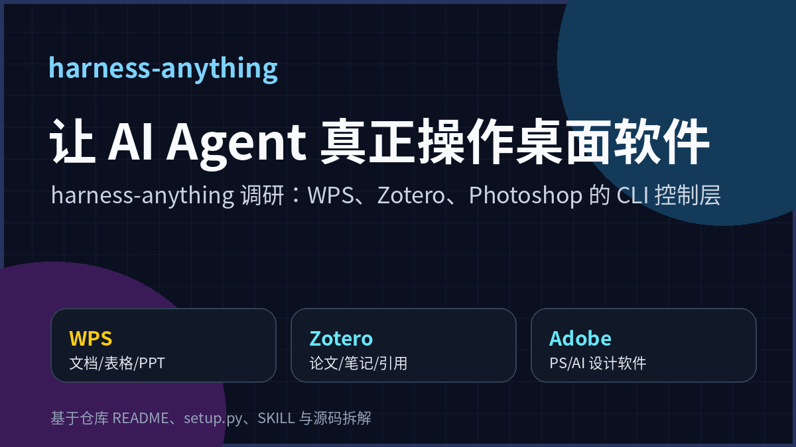
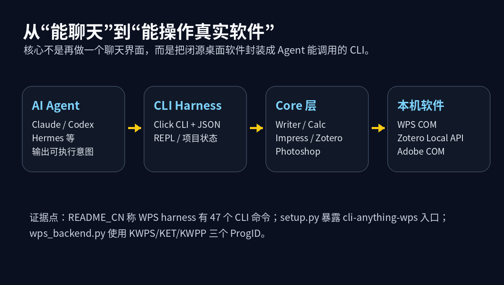
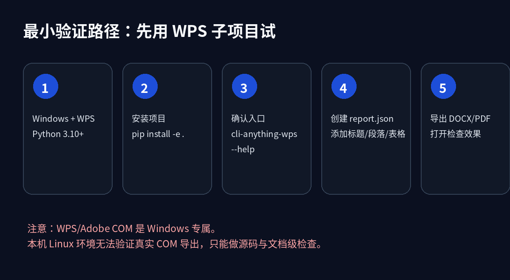
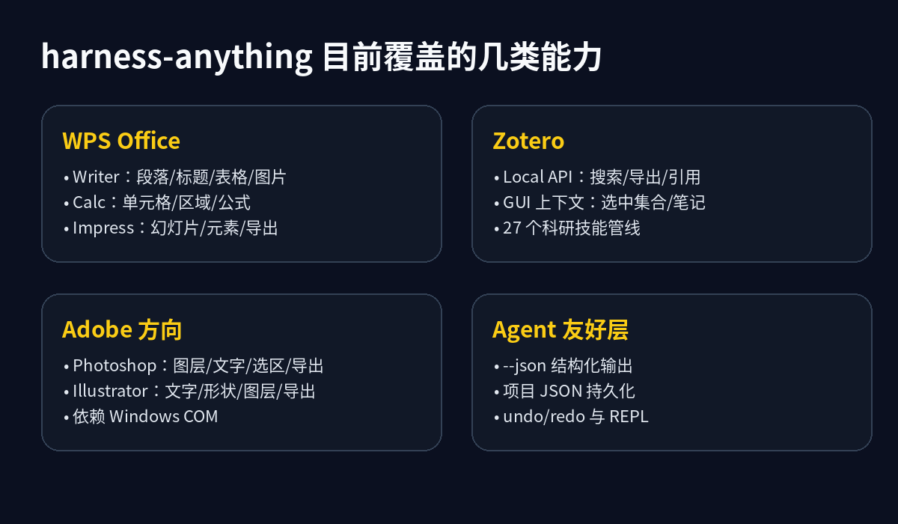
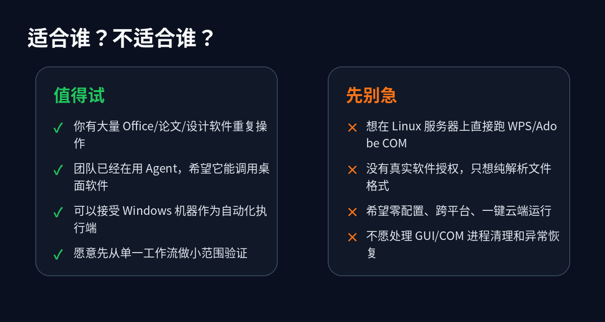

# harness-anything：让 AI Agent 操控 WPS、Zotero 和设计软件

AI Agent 最尴尬的地方，不是不会写一段 Python，而是它经常卡在真实软件前面。

写报告要用 WPS，整理文献要用 Zotero，做海报要用 Photoshop 或 Illustrator。人类点几下菜单就能完成的动作，对 Agent 来说反而像一堵墙。它能生成一段建议，却不一定能打开软件、改文档、导出文件。

[harness-anything](https://github.com/yb2460/harness-anything) 想解决的就是这件事：把这些桌面软件包一层命令行接口，让 Agent 像调用普通 CLI 一样调用 WPS、Zotero、Photoshop、Illustrator。

我本地查看的是提交 `b3a42f0`。GitHub API 显示项目约 852 stars、47 forks，MIT 许可。这个项目还很新，别把它当成成熟商业 RPA。但它的方向值得看：它不是让模型“描述怎么做”，而是给模型一个可以执行的控制层。



## 1. 它解决的不是“生成内容”，而是“操作软件”

很多 AI 工具停在内容生成层：写一段文字、给一份 Markdown、生成一段脚本。真正落地时，人还要把内容复制到 Office、改格式、导出 PDF、整理引用、处理图片。

harness-anything 的思路更像“控制适配器”。它把桌面软件已有的可编程接口封装成 CLI：

- WPS 走 Windows COM，入口包括 `KWPS.Application`、`KET.Application`、`KWPP.Application`；
- Zotero 组合 Local API、GUI 选中上下文和本地数据；
- Photoshop / Illustrator 方向也走 COM 自动化；
- 上层统一提供命令、`--json` 输出、项目文件、REPL 和 Agent 使用说明。



这和“让模型生成一个 docx 文件”不太一样。后者经常绕开真实软件渲染，格式细节容易翻车。COM 自动化的好处是调用真实 WPS 或 Adobe 程序，让软件自己完成编辑和导出。

代价也很明确：Windows 依赖更重，软件必须安装好，GUI/COM 进程清理也要认真处理。

## 2. 先看 WPS：这是目前最完整的一条线

仓库里的 `README_CN.md` 主要讲的是 `cli-anything-wps`。它把 WPS Writer、Calc、Impress 拆成三组能力。

Writer 能创建文档、添加段落/标题/列表/表格/图片/分页符，并导出 DOCX、PDF、TXT、HTML 等格式。Calc 能操作工作表、单元格、区域、公式和合并单元格，并导出 XLSX、CSV、PDF。Impress 能添加幻灯片、设置内容、添加元素，并导出 PPTX 或 PDF。

`setup.py` 里能看到 Python 包名是 `cli-anything-wps`，入口命令是：

```bash
cli-anything-wps
```

依赖也写得比较清楚：Python 3.10+，`click`、`prompt-toolkit`，以及仅在 Windows 上安装的 `pywin32`。

最小路径大概是这样：

```bash
git clone https://github.com/yb2460/harness-anything.git
cd harness-anything
pip install -e .

cli-anything-wps --help
```

然后新建一个 Writer 文档项目：

```bash
cli-anything-wps document new --type writer --name "年度报告" -o report.json
cli-anything-wps --project report.json writer add-heading -t "前言" -l 1
cli-anything-wps --project report.json writer add-paragraph -t "这是 AI 自动生成的报告。"
cli-anything-wps --project report.json writer add-table -r 3 -c 3
cli-anything-wps --project report.json export render report.docx -p docx
cli-anything-wps --project report.json export render report.pdf -p pdf
```



我这里是在 Linux 环境调研源码，不能实际启动 WPS COM 导出。仓库的 `CONTRIBUTING.md` 写了 WPS core 单测路径，`cli_anything/wps/tests/test_core.py` 覆盖文档创建、Writer、Calc、Impress、Session 等数据层操作；但真实导出仍然需要 Windows + WPS + pywin32。

这点别忽略。你要验证这个项目，最好找一台干净 Windows 机器，而不是在服务器上硬跑。

## 3. 为什么它对 Agent 友好：`--json`、项目 JSON 和会话

一个 CLI 给人用和给 Agent 用，差别很大。

人可以读一屏文字，猜下一步怎么做。Agent 更需要稳定结构：命令执行成功了吗？输出文件在哪？当前项目是什么类型？下一步能不能撤销？

WPS harness 在这方面做了几件实用的小事：

```bash
cli-anything-wps --json document new --type writer --name "test"
cli-anything-wps --json --project test.json session status
```

所有命令都可以走 `--json`。`session.py` 里还有项目状态、撤销/重做栈和最多 50 步历史。项目本身是 JSON，这意味着 Agent 可以把一次文档编辑拆成多步：先生成项目文件，再逐步添加内容，最后导出。

这比直接让模型吐一个复杂二进制文档可靠。中间态可检查，失败了也能知道失败在哪。

## 4. Zotero 线：更像科研工作流入口

`cli_anything/zotero/skills/SKILL.md` 显示，Zotero harness 不是重写 Zotero，而是组合 Zotero 的真实本地能力。

它的命令组包括 app、collection、item、search、tag、style、import、note、session。几个典型动作：

```bash
cli-anything-zotero app status --json
cli-anything-zotero collection use-selected --json
cli-anything-zotero item citation <item-key> --style apa --locale en-US --json
cli-anything-zotero item context <item-key> --include-notes --include-links --json
```

限制也写得比较诚实：搜索、导出、引用和 bibliography 依赖 Zotero Local API；添加 note 依赖正在运行的 Zotero GUI 上下文；一些 SQLite 写入命令属于本地 power-user 操作，不该当稳定接口乱用。

它更适合做“科研 Agent 的资料入口”：选中一批文献，提取引用、笔记、附件线索，再交给模型做综述、提纲或审稿检查。

## 5. Photoshop / Illustrator：方向有价值，但更要看边界

仓库里还有 Photoshop 和 Illustrator harness。

Photoshop 的 SKILL 文档列了项目管理、图层、选区、文字、导出等命令，例如：

```bash
cli-anything-photoshop --json project new -w 800 -h 600 poster.psd
cli-anything-photoshop --json --project poster.psd text add -t "Hello World" -f Arial -s 48 -c "#FF0000"
cli-anything-photoshop --json --project poster.psd layer list
cli-anything-photoshop --json --project poster.psd export save -f png output.png
```

Illustrator 的 CLI 也能看到 project、layer、text、shape、export 等命令组。

这类能力非常诱人：让 Agent 自动改图层、替换文字、导出多尺寸素材。但它比 Office 自动化更容易踩坑。设计软件的状态更复杂，图层命名、字体缺失、插件弹窗、颜色配置、文件路径都会影响结果。

所以我不会建议一开始就拿它做“全自动设计师”。更现实的用法是：固定模板、固定图层命名、固定导出规格，让 Agent 执行重复动作。



## 6. 适合谁？不适合谁？

值得试的场景：

- 你有大量 WPS/Office 批量报告、合同、表格、PPT 导出任务；
- 你在做科研工作流，希望 Agent 读取 Zotero 里的文献、笔记和引用；
- 你有固定 PSD/AI 模板，需要自动替换文字、图片、图层并批量导出；
- 你愿意专门准备一台 Windows 自动化机器。

不适合的场景：

- 你只想在 Linux 服务器上跑，无 Windows 桌面环境；
- 你没有安装 WPS、Zotero、Adobe，也不想处理授权和 GUI；
- 你希望它像纯 Web API 一样稳定，不想碰 COM 进程；
- 你的文件结构高度不固定，每次都要靠模型临场判断。



## 7. 我建议的验证方式

不要一上来就把它接进生产链路。先做一个很窄的验收任务。

比如 WPS：

1. 准备一台 Windows 机器，安装 WPS Office 和 Python 3.10+；
2. 安装项目和 `pywin32`；
3. 用 `cli-anything-wps --help` 确认命令入口；
4. 跑一个 Writer 示例，生成 `report.json`；
5. 导出 DOCX 和 PDF；
6. 人工打开文件，看标题、段落、表格、分页、字体是否符合预期；
7. 再让 Agent 调用同一组命令，观察它能否读懂 JSON 输出并继续下一步。

如果这条链路稳定，再扩展到 Calc 或 Impress。不要同时验证 WPS、Zotero、Photoshop、Illustrator。那样出了问题，你很难知道是 Agent 规划错了，还是软件接口、环境、文件模板出了问题。

## 8. 这个项目最值得借鉴的地方

我不觉得 harness-anything 的价值只在“这几个软件已经能用了”。真正值得借鉴的是它的接口思想：

> 只要软件有稳定的本地可编程接口，就可以在外面包一层 Agent 友好的 CLI。

这件事很朴素，但对很多企业内部软件很有用。大量系统没有好用 API，却有 COM、脚本接口、插件接口、命令行、宏或者本地数据库。把这些能力整理成小而稳定的 CLI，比指望模型直接操作 GUI 更可控。

如果你要复刻这个思路，我建议遵守四条规则：

- 每个命令都支持 `--json`；
- 所有中间状态落到可读项目文件；
- 真实软件执行和纯数据层逻辑分开测试；
- 明确写出平台依赖、软件版本和不可自动化的边界。

这样 Agent 才不是“会说”，而是真的多了一双手。
