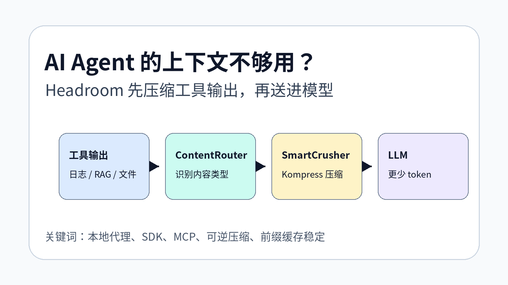
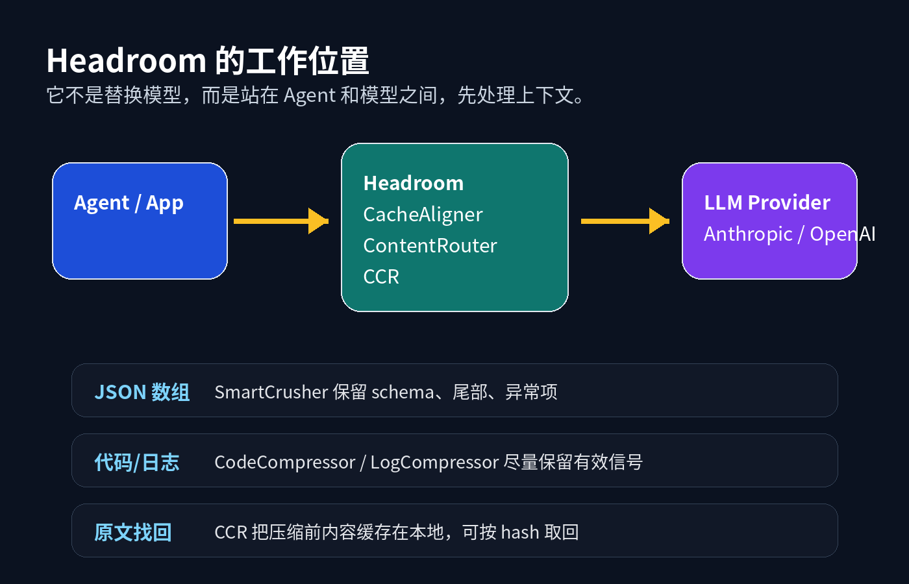
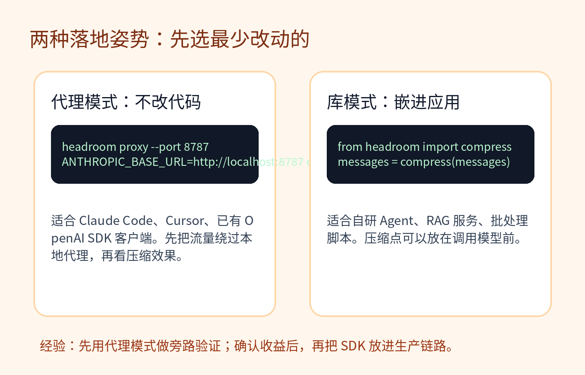
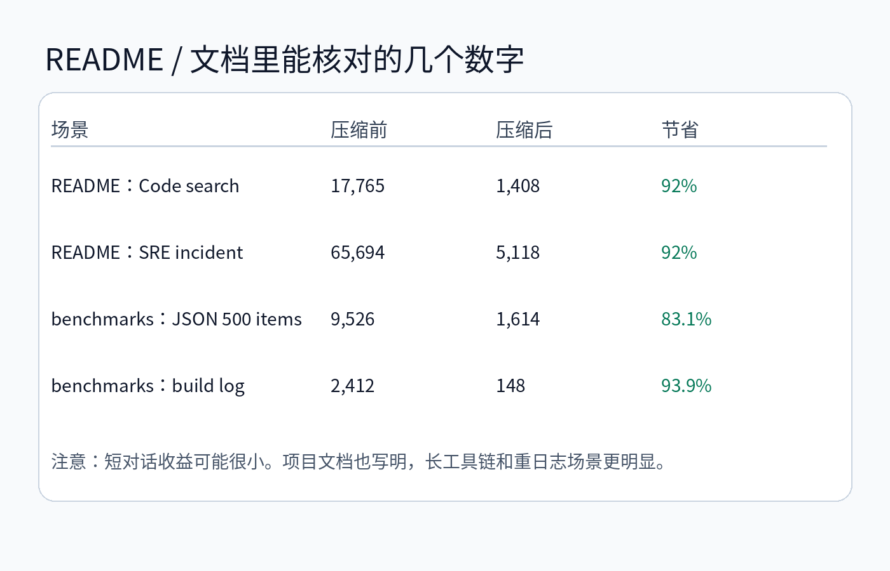
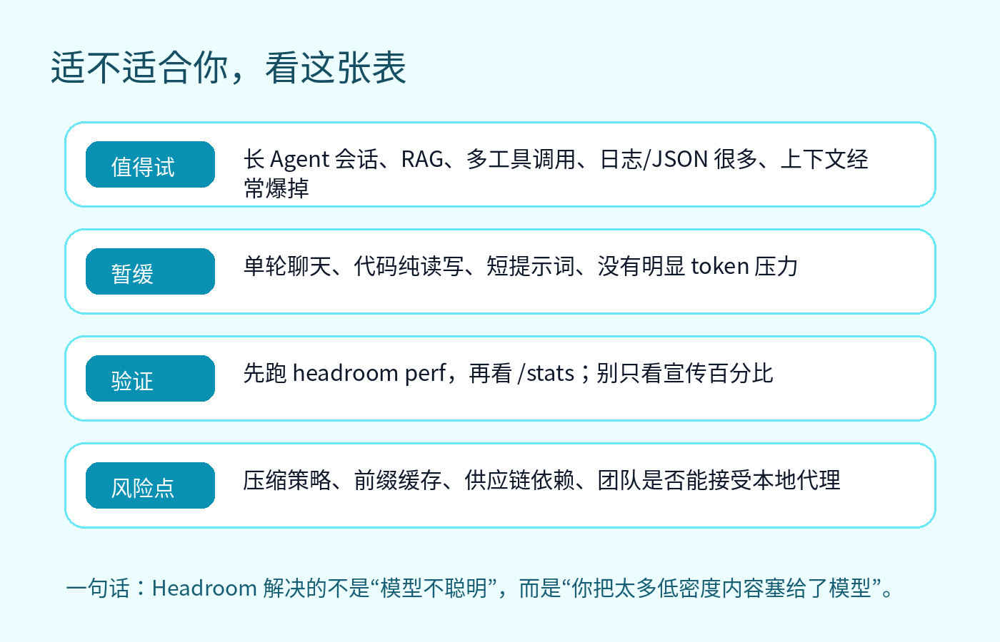

# 别再把一整坨日志塞给模型了：Headroom 给 AI Agent 做上下文压缩

AI Agent 用久了，最烦人的问题不一定是模型不够聪明，而是上下文被工具输出撑爆。

一次 `grep`，几百行。一次测试失败，上千行。RAG 返回一批文档，真正有用的也许只有几段。你当然可以换更大上下文窗口，但这通常只是把问题往后推：成本更高，延迟更长，模型也更容易在噪声里迷路。

Headroom 做的是另一件事：在 Agent 和 LLM 之间加一层上下文压缩，把工具输出、日志、RAG chunk、文件内容、对话历史先处理一遍，再送进模型。

项目地址：[https://github.com/chopratejas/headroom](https://github.com/chopratejas/headroom)。我本地查看的是提交 `3fc2a78`，GitHub API 显示项目约 38.6k stars、Apache-2.0 许可。



## 1. 这个项目解决的不是“提示词太长”，而是“上下文里垃圾太多”

README 里有一句话很直接：Headroom compresses everything your AI agent reads before it reaches the LLM。它处理的不是最终回答，而是模型读到的输入。

典型来源包括：

- 工具输出，比如搜索结果、文件列表、API 返回 JSON；
- 构建和测试日志；
- RAG 检索出来的 chunk；
- 被 Agent 读进上下文的文件；
- 多轮对话历史。

坏的做法是把这些东西原封不动塞给模型。好的做法是先判断内容类型，再用不同策略压缩。



源码里的 `TransformPipeline` 也印证了这个思路。默认顺序大致是：先做 `CacheAligner`，再由 `ContentRouter` 接管内容感知压缩。`ContentRouter` 里明确写了路由策略：JSON array 走 SmartCrusher，日志走 LogCompressor，普通文本可走 Kompress，代码则尽量用 AST-aware 的方式处理。

这点比“直接摘要一下工具输出”要可靠得多。日志、代码、JSON、普通文章不是一种东西，用同一个摘要器压缩，很容易把关键异常、结构字段或者代码语义抹掉。

## 2. 三种用法：代理、SDK、MCP

Headroom 不是只给某一个 Agent 做插件。README 里列了几种入口：

```bash
pip install "headroom-ai[all]"
npm install headroom-ai

headroom wrap claude
headroom proxy --port 8787
headroom perf
```

如果你只是想先验证效果，最简单的是代理模式。

```bash
headroom proxy --port 8787
ANTHROPIC_BASE_URL=http://localhost:8787 claude
```

OpenAI 兼容客户端则可以这样接：

```bash
OPENAI_BASE_URL=http://localhost:8787/v1 your-app
```

如果你在写自己的 Agent 或 RAG 服务，可以把它当库用，在调用模型前压缩 `messages`。

```python
from headroom import compress

messages = [
    {"role": "user", "content": "..."},
]
messages = compress(messages)
```



我的建议是：先用代理模式做旁路验证。它改动小，失败了也容易回滚。等你确认某类工作流确实节省 token，再考虑把 SDK 放进生产链路。

## 3. 它的关键设计：压缩不是一次性丢弃，而是可找回

传统压缩最怕什么？怕压掉了真正重要的信息。

Headroom 文档里有一个 CCR 设计，意思是 Compress-Cache-Retrieve。它会把原始内容缓存在本地，压缩后的内容里带引用。模型如果需要更多信息，可以通过 retrieval 工具把原文取回来。

文档里的例子是：1000 个 item 被 SmartCrusher 压到 20 个，原始数组用 hash 缓存。如果模型靠这 20 个 item 已经能解决问题，那就省掉大部分 token；如果不够，它再按 hash 取回完整数据。

这个设计的价值在于，它把“省 token”和“怕丢信息”的冲突缓和了。你不用一开始就把所有东西都喂进去，也不必完全赌压缩器不会犯错。

## 4. 能省多少？要看场景，不要只看最大数字

README 的 Proof 部分给了几个 Agent workload 数字：



项目文档 `wiki/benchmarks.md` 里还有更细的测试：JSON array、shell output、build log 都有明显压缩；但 grep results 和 Python source 在某些测试里是 0% 压缩，因为它们已经是相对紧凑或需要保真。

这反而是好事。一个可靠的压缩层不应该见什么都压。代码、搜索结果这类内容如果乱压，可能省了一点 token，最后把任务做错。

文档也写得比较克制：短对话的中位压缩只有 4.8%，长工具会话、JSON-heavy、构建日志、多工具 Agent 才更明显。

## 5. 最小上手流程

如果你想在本地试一下，可以按这个顺序来。

第一步，安装：

```bash
pip install "headroom-ai[all]"
```

第二步，跑一个本地代理：

```bash
headroom proxy --port 8787
```

第三步，把你的 Agent 指到代理。

Claude Code：

```bash
ANTHROPIC_BASE_URL=http://localhost:8787 claude
```

OpenAI SDK：

```python
from openai import OpenAI

client = OpenAI(
    base_url="http://localhost:8787/v1",
    api_key="your-api-key",
)
```

第四步，看代理状态和节省情况：

```bash
curl http://localhost:8787/health
curl http://localhost:8787/stats
```

如果你只想测试压缩服务，不想真的调用模型，文档里也提供了 `/v1/compress`。

## 6. 什么时候值得用，什么时候别急



值得试的情况：

- 你在重度使用 Claude Code、Codex、Cursor、Aider 这类 Agent；
- 工具调用多，日志、JSON、RAG 返回内容经常很长；
- 上下文窗口经常不够，或者成本/延迟明显上升；
- 团队愿意接受一个本地代理层，并能监控它的效果。

暂时没必要的情况：

- 只是偶尔问几句单轮问题；
- 主要是短 prompt，不跑工具链；
- 对供应链和代理层非常敏感，还没时间审计；
- 你的瓶颈是模型能力，而不是上下文噪声。

## 7. 我会重点检查的风险点

第一，压缩准确性。尤其是日志和 JSON 里的异常项，必须能保住。Headroom 的 SmartCrusher 会保留 schema、尾部、异常项和统计分布，这个设计方向是对的，但你仍然要用自己的真实数据测。

第二，缓存稳定性。代理文档里区分了 `token` 和 `cache` 模式：前者优先压缩，可能重写历史；后者优先保持 prefix cache 稳定。长会话里这不是小事，缓存命中有时比多压一点 token 更值钱。

第三，部署边界。它默认本地优先，这对隐私是加分项；但只要你把它放进生产链路，就要关心版本、日志、监控、降级和故障旁路。

第四，不要把“压缩率”当唯一 KPI。更重要的是：答案有没有变差、延迟有没有增加、缓存命中有没有受影响、出错时能不能回滚。

## 8. 一句话总结

Headroom 的价值不是让模型变聪明，而是少喂它低密度内容。

如果你的 AI Agent 已经进入“工具调用多、日志很多、上下文经常爆”的阶段，这个项目值得花半小时试一下。先用代理模式跑真实工作流，看 `/stats`，再决定要不要深入接入。

如果你只是偶尔聊天，或者上下文还没成为成本和质量问题，那就先收藏。等你第一次被几万行日志拖慢 Agent 的时候，再回来试它也不晚。

## 参考

- GitHub: [https://github.com/chopratejas/headroom](https://github.com/chopratejas/headroom)
- README: `README.md`
- 架构文档: `wiki/ARCHITECTURE.md`
- 代理文档: `wiki/proxy.md`
- CCR 文档: `wiki/ccr.md`
- Benchmark 文档: `wiki/benchmarks.md`
