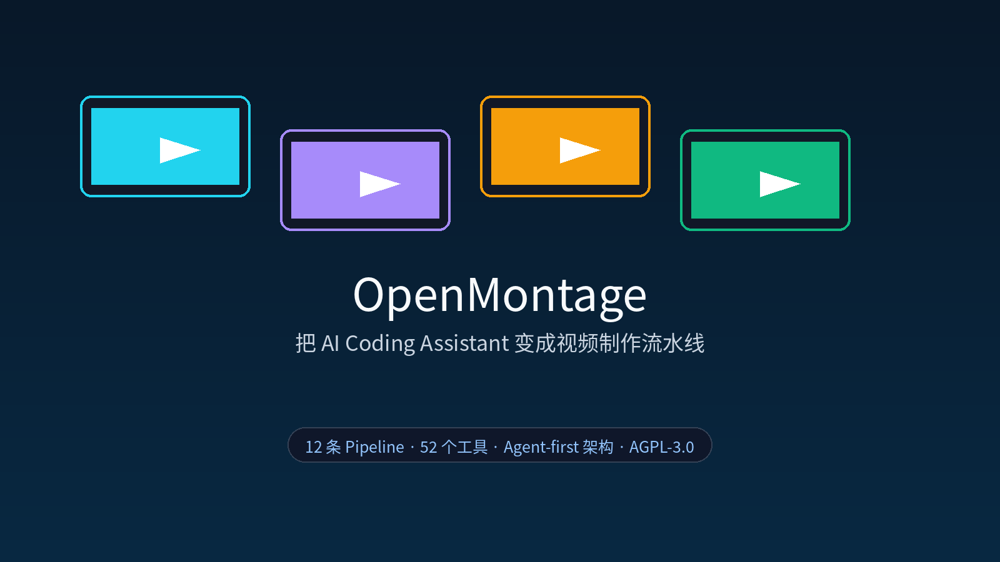
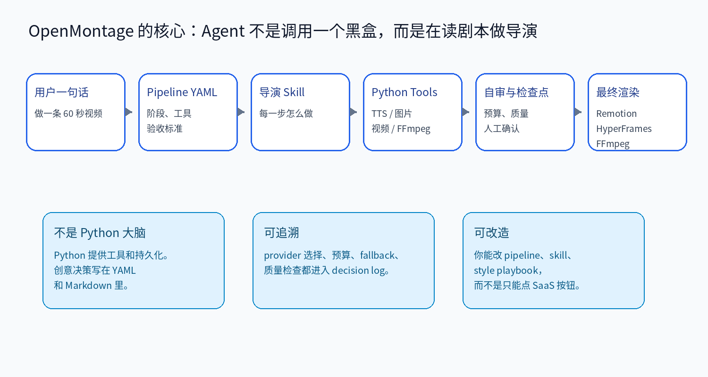
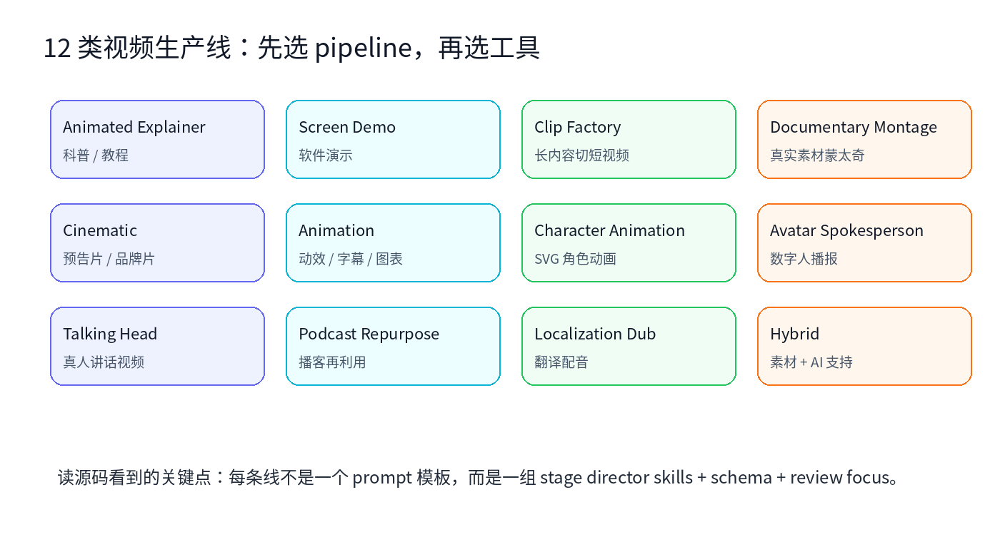
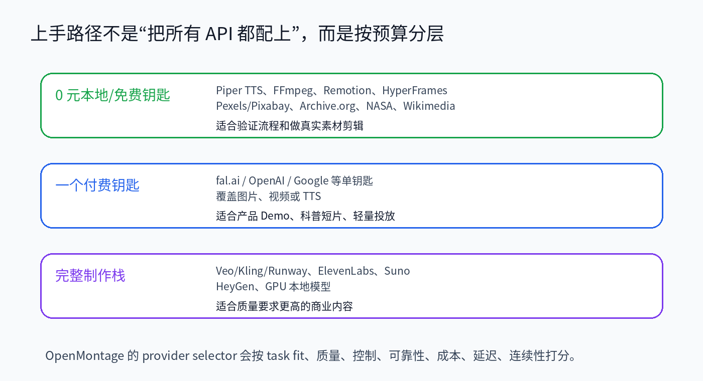
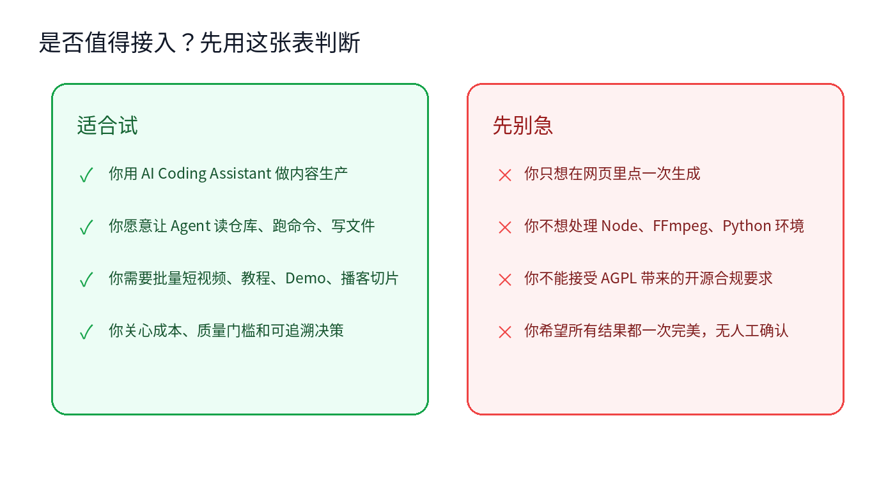

# OpenMontage：把 AI Coding Assistant 变成视频制作流水线

多数 AI 视频工具都在卖一个很诱人的入口：输入一句话，等它吐出一段视频。

问题是，真正做视频不是这么简单。你要定选题，找资料，写脚本，做分镜，生成或挑选素材，配音，配乐，上字幕，剪辑，渲染，最后还要检查黑帧、音量、字幕、画面是不是像 PPT。

OpenMontage 的思路不一样。它不是再做一个网页生成器，而是把 Claude Code、Cursor、Copilot、Windsurf、Codex 这类 AI Coding Assistant 当成“导演”，让它读 Pipeline、读 Skill、调用工具、写检查点，最后产出一条视频。

项目地址：[https://github.com/calesthio/OpenMontage](https://github.com/calesthio/OpenMontage)。我本地查看的是提交 `9066dcb`，GitHub API 显示项目约 6.7k stars、1.1k forks，许可为 AGPL-3.0。



## 1. 它解决的不是“生成一个片段”，而是“组织一条生产线”

README 对 OpenMontage 的定义很直接：the first open-source, agentic video production system。更关键的一句是：turn your AI coding assistant into a full video production studio。

这句话容易被当成宣传语，但看完仓库结构后，我觉得它指向的是一个具体设计：



OpenMontage 没有把所有智能都塞进一个 Python orchestrator。文档里反复强调：AI coding assistant 本身就是 orchestrator。Python 主要提供工具、注册表、配置、预算和检查点；真正的生产规则写在 YAML 和 Markdown 里。

这会带来一个很实际的差异：你不是只能相信一个黑盒按钮，而是可以打开 `pipeline_defs/` 看每条生产线怎么走，打开 `skills/pipelines/` 看每个阶段怎么执行，打开 `schemas/` 看产物结构怎么校验。

## 2. Agent-first：让模型读“剧本”，而不是临场发挥

`AGENT_GUIDE.md` 里有一条硬规则：所有视频生产请求都必须走 pipeline system。

典型流程是：

```text
用户提出视频需求
-> Agent 选择 pipeline
-> 读取 pipeline_defs/<pipeline>.yaml
-> 每个阶段读取对应 stage director skill
-> 调用 Python tools
-> 写 checkpoint
-> 自审
-> 必要时等待人工确认
-> 渲染成最终视频
```

这个设计的好处是，把 Agent 最容易失控的地方框住了。

如果你直接让模型“帮我做个视频”，它可能今天写脚本，明天跳过素材检查，后天直接调用一个最贵的模型。OpenMontage 要求它先选 pipeline，再按阶段读 director skill，每个关键选择都要留下 decision log。

我看 `AGENT_GUIDE.md` 时最有感觉的是这句：The intelligence is in the skills, not in improvised code。也就是说，它不鼓励 Agent 临时写脚本乱拼，而是鼓励 Agent 先读规则，再调用工具。

这和现在很多 Agent 工程的趋势一致：模型不一定更自由才更可靠。恰恰相反，越是昂贵、长链路、容易出错的任务，越需要可读的操作契约。

## 3. 它内置的不是一条视频链路，而是多条 Pipeline

OpenMontage 的 `pipeline_defs/` 里能看到 13 个 YAML，其中 12 条是面向真实生产的 pipeline，另有一条 smoke test。README 里列出的类型包括 Animated Explainer、Screen Demo、Clip Factory、Documentary Montage、Cinematic、Animation、Localization & Dub、Podcast Repurpose、Talking Head 等。



这点很重要。因为“做视频”其实不是一种任务。

做一个产品演示，需要屏幕录制、节奏控制和注释层。做一个播客切片，需要转写、找高能片段、重排和字幕。做一个纪录片蒙太奇，需要素材检索、镜头选择、音乐和节奏。做一个角色动画，又会牵涉 SVG rig、动作库和 GSAP 时间线。

如果把这些都塞进一个超级 prompt，结果通常很脆。OpenMontage 的做法是先承认任务类型不同，再给每类任务独立的阶段、工具和审查重点。

## 4. 免费路径不是噱头：真实素材和本地工具也能跑

README 里有一个容易被忽略的点：OpenMontage 不只会做“几张图动一动”的视频。它强调可以走 real-footage documentary path：从 Archive.org、NASA、Wikimedia Commons，以及 Pexels、Pixabay、Unsplash 这类免费素材源构建语义可检索的素材库，再剪成真正的 motion footage 时间线。

它也支持图像视频路线。没有视频生成 API 时，可以用 Piper TTS、Remotion、HyperFrames、FFmpeg，把图片、字幕、图表、音频组织成可交付的视频。



所以它的上手路径不应该是“一口气把所有 API Key 都配上”。更合理的是：

第一层，零成本验证。装好 Python、Node、FFmpeg，用本地 Piper TTS、Remotion/HyperFrames、免费素材源跑通流程。

第二层，只接一个主要付费入口。比如用 fal.ai 覆盖部分图片/视频生成，或者用 OpenAI/Google 覆盖语音和图片，先做产品 Demo、科普短片、内部验证。

第三层，再接完整制作栈。Veo、Kling、Runway、ElevenLabs、Suno、HeyGen、本地 GPU 模型，这些东西能提高质量，但也会放大成本和复杂度。

## 5. Provider Selector：它不是“有哪个 key 就用哪个”

OpenMontage 的工具层有一个 selector pattern。架构文档里写了三个 selector：`tts_selector`、`image_selector`、`video_selector`。

它们不是简单地按固定顺序挑 provider，而是按多维度评分：task fit、output quality、control、reliability、cost efficiency、latency、continuity。

这对视频生产很关键。

同样是生成视频，有的任务更看重角色一致性，有的任务更看重运动质量，有的任务更看重成本，有的任务只是要快速出样。一个好系统不应该永远调用“最强模型”，也不应该永远调用“最便宜模型”。它应该知道这次任务最怕什么。

OpenMontage 还要求在重要生产决策前告知用户：用哪个工具、哪个 provider、哪个模型、为什么这么选、这次是 sample 还是 batch run。这个要求看起来啰嗦，但对控制成本很有用。视频 API 一旦批量跑起来，账单不是开玩笑的。

## 6. 质量门禁：防止“看起来像视频的 PPT”

AI 视频系统最常见的翻车是：生成流程很热闹，最后成片很尴尬。

OpenMontage 在 README 的 Production Governance 部分写了几类门禁：

- pre-compose validation：渲染前检查 delivery promise、slideshow risk、renderer family；
- post-render self-review：用 ffprobe、抽帧、音频分析、字幕检查验证结果；
- slideshow risk scoring：从重复度、弱运动、镜头意图、字幕依赖等维度判断是不是“动画 PPT”；
- source media inspection：用户给素材时先 probe 分辨率、编码、音轨、时长，不靠文件名瞎猜。

这类东西比“提示词再写精美一点”更重要。视频生产是长链路任务，真正节省时间的不是第一版永远完美，而是系统能尽早发现坏计划、坏素材、坏渲染。

## 7. 最小上手流程

先准备基础环境：

```bash
# macOS
brew install ffmpeg

# Ubuntu / Debian
sudo apt update
sudo apt install -y ffmpeg

# Node.js 18+、Python 3.10+ 也需要提前准备
```

然后克隆并安装：

```bash
git clone https://github.com/calesthio/OpenMontage.git
cd OpenMontage
make setup
```

如果没有 `make`，README 给了手动路径：

```bash
pip install -r requirements.txt
cd remotion-composer
npm install
cd ..
pip install piper-tts
cp .env.example .env
```

接着把仓库打开到你的 AI Coding Assistant 里，先让它读规则，而不是直接生成：

```text
Read AGENT_GUIDE.md and PROJECT_CONTEXT.md first.
Then audit available tools and tell me which OpenMontage pipelines I can run on this machine.
```

如果你想零成本验证，可以试这种需求：

```text
Make a 45-second animated explainer about why the sky is blue.
Use only local/free tools if possible. Show the production plan and cost estimate before generating assets.
```

如果你想测试真实素材路线，可以明确写：

```text
Make a 60-second documentary montage about city life in the rain.
Use real footage only, no narration, elegiac tone, with music.
Prefer open/free footage sources.
```

## 8. 适合谁，不适合谁



我会把 OpenMontage 推荐给三类人：

第一类，已经在用 AI Coding Assistant 做内容生产的人。你不是只想聊天，而是愿意让 Agent 读文件、跑命令、改配置、产出资产。

第二类，需要批量视频工作流的人。比如课程切片、产品 Demo、播客再利用、内部培训、短视频矩阵。单条视频手工做也能做，但批量时流程化价值才出来。

第三类，想掌控成本和可追溯性的人。OpenMontage 的预算估算、provider selector、decision log、quality gate，都是为了减少“模型偷偷帮你花钱”和“结果坏了但不知道为什么”的情况。

但它不适合所有人。

如果你只想打开网页，输入一句话，等一个黑盒结果，那直接用商业 AI 视频 SaaS 更省心。如果你不想碰 Python、Node、FFmpeg，也不想让 Agent 操作本地仓库，那 OpenMontage 的工程味会显得重。如果你不能接受 AGPL-3.0 带来的开源合规要求，也要先停下来评估。

## 9. 我的判断

OpenMontage 现在最值得看的，不是它能不能一次生成“完美大片”。这类承诺我一般都打折听。

它真正有意思的地方，是把视频生产拆成了 Agent 能执行、能检查、能记录、能回滚的工程流程。

如果你把它当成“一键生成视频工具”，可能会失望。它需要环境，需要 API，需要素材源，需要人工确认，也需要你理解 pipeline。

但如果你把它当成“开源的视频生产工作台”，它的方向很清楚：让 AI Coding Assistant 不只是写代码，而是带着工具、预算、质量门禁和审查记录，参与一整条内容生产线。

这可能比又一个漂亮的生成按钮更有长期价值。
