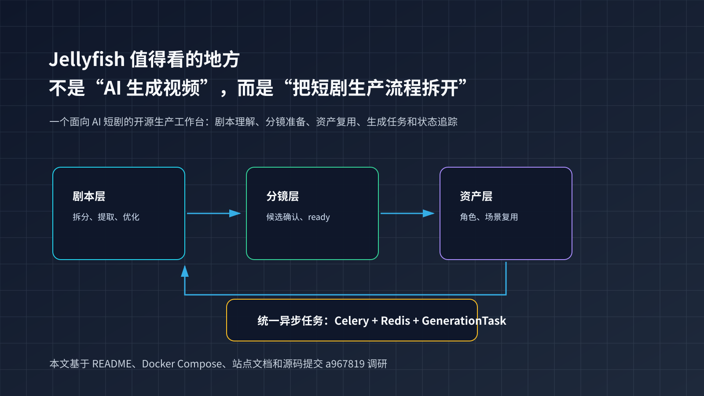
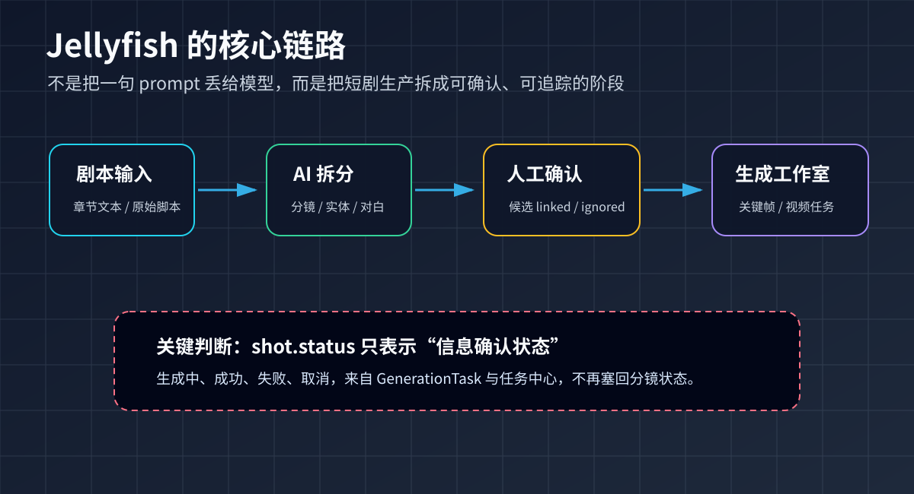
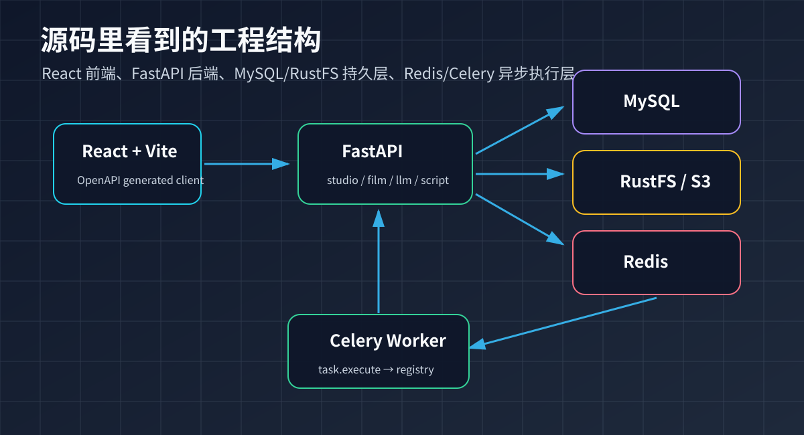
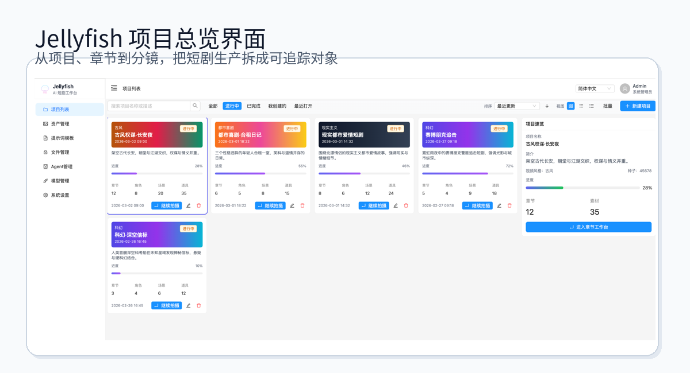
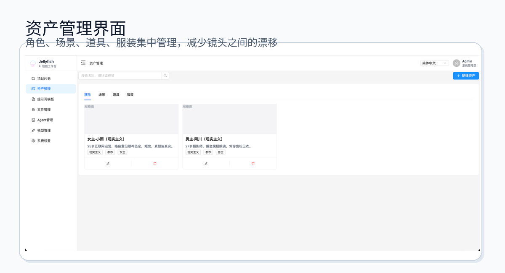
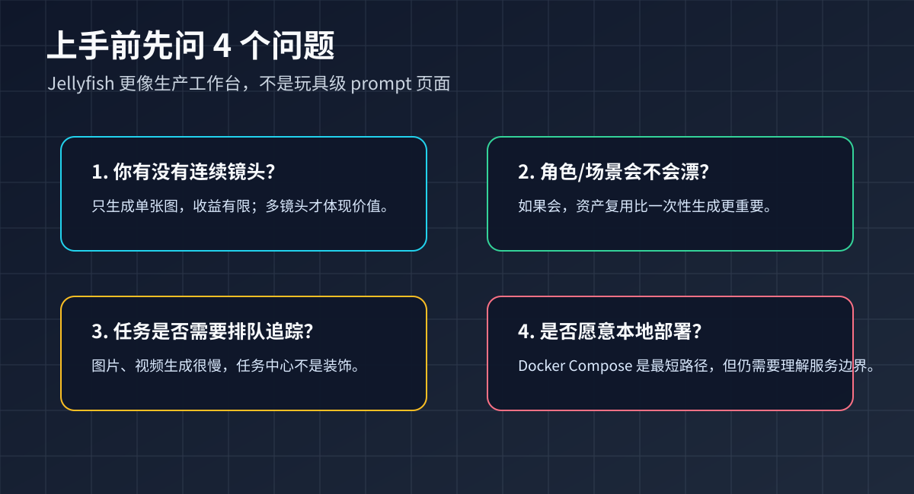

# Jellyfish：把 AI 短剧从“一键生成”拆成可控生产线

AI 短剧工具最容易讲成一句话：“输入剧本，自动生成视频。”

这句话很诱人，但也很容易骗人。真正做一条短剧，不是把一段文字丢给视频模型就结束。你要先把剧本拆成镜头，确认每个镜头里有哪些角色、场景、道具和对白，再处理角色一致性、关键帧、视频提示词、生成任务、失败重试和素材回写。

[Jellyfish](https://github.com/Forget-C/Jellyfish) 值得看的地方正在这里。它不是另一个“prompt 到视频”的玩具，而是一个面向 AI 短剧的生产工作台：把剧本、分镜、资产和长耗时生成任务放进同一套数据流里。

我本地调研的是提交 `a967819`。GitHub API 显示项目约 4.45k stars、775 forks，许可是 Apache-2.0。下面这篇不是 README 翻译，而是从 README、Docker Compose、站点文档和源码结构里拆出来的一条上手路线。



## 1. 它解决的不是“生成”，而是“生成前后怎么组织”

很多 AI 视频产品把注意力集中在最后一步：调用模型，得到视频。Jellyfish 的 README 反而把前面的工作拆得很细：script understanding、shot preparation、asset consistency、generation execution、task tracking。

这几个词放在一起，说明它关心的是生产链路，而不是单点模型能力。



一个典型流程是：

```text
输入章节剧本
-> AI 拆分分镜
-> 提取角色 / 场景 / 道具 / 服装 / 对白候选
-> 人工确认候选：接受、关联已有资产或忽略
-> 分镜进入 ready
-> 在工作室生成关键帧、参考图和视频
-> 异步任务回写结果
```

这比“一键生成”麻烦，但也更接近真实生产。因为短剧最怕的不是第一帧不好看，而是第 8 个镜头里同一个角色突然换脸，第 12 个镜头场景关系断了，第 20 个镜头任务失败后没人知道结果去哪了。

Jellyfish 把这些中间状态做成显式对象。源码和文档里能看到 `shot_extracted_candidates`、`shot_extracted_dialogue_candidates`、`GenerationTask`、`GenerationTaskLink` 这类概念。它们听起来不性感，但对生产系统很关键。

## 2. 一个关键设计：ready 不是 generating

我觉得 Jellyfish 最值得新手注意的细节，是它对 `shot.status` 的收敛。

站点架构文档 `site/content/docs/architecture/shot-status-flow.md` 里写得很清楚：`shot.status` 只保留 `pending` 和 `ready` 两种正式状态。它表示“信息提取确认是否完成”，不表示“正在生成”。

这和很多原型项目的做法不一样。

差的做法是把所有状态都塞进一个字段：

```text
pending -> extracting -> ready -> generating -> done -> failed
```

看起来省事，后面一定乱。因为“分镜准备好了”和“某个视频任务正在跑”不是同一类状态。一个镜头可能已经 ready，但视频任务失败；也可能有多个图片任务和一个视频任务同时存在。

Jellyfish 的做法是拆开：

```text
shot.status：pending / ready
GenerationTask：pending / running / succeeded / failed / cancelled
```

这就是工程上的非显眼收益。它不只是让页面更清楚，也让任务恢复、取消、重试和跳转更容易做。`site/content/docs/architecture/task-execution.md` 里还写到，前端不直接读取 Celery task 状态，`GenerationTask` 才是业务任务的真相源。

## 3. 源码结构：前端是工作台，后端是任务和数据流

从仓库结构看，Jellyfish 是一个比较典型的前后端分离项目，但它的模块划分围绕短剧生产而不是围绕技术名词。



前端在 `front/`：React 18、Vite、Ant Design、Zustand。`front/package.json` 里可以看到 `pnpm run openapi:update`，会从后端拉 `openapi.json` 并生成 `front/src/services/generated/`。这点很重要：前端调用后端不是靠手写一堆 service，而是尽量走 OpenAPI generated client。

后端在 `backend/`：FastAPI、SQLAlchemy async、Pydantic、LangChain/LangGraph、Celery、Redis。`backend/app/api/v1/__init__.py` 把路由聚合成四组：

```text
/api/v1/studio
/api/v1/film
/api/v1/llm
/api/v1/script-processing
```

这四组刚好对应生产链路：工作台对象、生成任务、模型管理、剧本处理。

数据和基础设施上，Docker Compose 默认拉起 MySQL、Redis、RustFS、backend、celery-worker、front。RustFS 是 S3 兼容对象存储，用来放素材文件；Redis 是 Celery broker；MySQL 存业务数据。

这里有一个实际判断：Jellyfish 不是“下载即玩”的轻量小工具。它更像一个本地 AI Studio。你愿意跑一套服务，它才有意义。

## 4. 分镜准备页和工作室分工明确

项目里的 `AGENTS.md` 对页面职责写得很硬：

- 分镜编辑页 = 准备，负责资产、对白提取、候选确认、基础信息修正；
- 分镜工作室 = 生成，负责视频准备度、关键帧、图片、视频参数与视频生成；
- 任务中心 = 通用任务状态面板，只展示状态、进度、成功失败、取消与回跳入口。

这个边界很实际。很多 AI 内容工具会把“编辑”“确认”“生成”“任务日志”堆在同一页，短期开发快，长期用户会懵。Jellyfish 的边界是：先把镜头准备好，再进工作室生成；任务状态留给任务中心，不让每个页面自己发明一套状态提示。



从 README 的截图也能看出，它不是只展示一段 prompt，而是围绕项目、章节、分镜和资产组织页面。

## 5. 资产一致性是它的主战场

AI 短剧最容易翻车的地方不是“模型不会画”，而是模型每次都画得不一样。

Jellyfish 把角色、演员、场景、道具、服装作为共享实体管理。README 里写到，系统维护 characters / actors / scenes / props / costumes 的共享 entity model，并支持跨镜头复用。



这比“每个镜头都塞完整提示词”更稳定。提示词可以补充细节，但资产应该有自己的身份。一个角色在第 1 镜头确认过，后面就应该能被关联和复用，而不是让模型每次重新猜。

源码里也能看到这条线：`backend/app/services/studio/shot_extracted_candidates.py`、`shot_character_links.py`、`entity_images.py`、`entity_specs.py` 等文件都在服务这个目标。

## 6. 最小上手：先用 Docker Compose 跑起来

如果只是体验，不建议一开始就拆前后端本地开发。最短路径是 Docker Compose。

```bash
git clone https://github.com/Forget-C/Jellyfish.git
cd Jellyfish
cp deploy/compose/.env.example deploy/compose/.env
```

按需编辑 `deploy/compose/.env`。默认关键项大概是：

```env
MYSQL_DATABASE=jellyfish
MYSQL_USER=jellyfish
MYSQL_PASSWORD=change-me
REDIS_PORT=6379
RUSTFS_ACCESS_KEY=rustfsadmin
RUSTFS_SECRET_KEY=rustfsadmin
S3_BUCKET_NAME=jellyfish-assets
BACKEND_URL=http://localhost:8000
# 如果要真实调用模型，再设置 OPENAI_API_KEY
# OPENAI_API_KEY=
```

启动：

```bash
docker compose --env-file deploy/compose/.env   -f deploy/compose/docker-compose.yml up --build
```

默认访问：

```text
前端：http://localhost:7788
后端：http://localhost:8000
Swagger：http://localhost:8000/docs
RustFS Console：http://localhost:9001
```

第一次启动会初始化数据库，并导入提示词模板数据。你可以先打开 `/docs` 看接口是否正常，再打开前端创建项目和章节。

## 7. 本地开发路径

如果你要改代码，再分开启动。

后端：

```bash
cd backend
cp .env.example .env
uv sync
uv run uvicorn app.main:app --reload --host 0.0.0.0 --port 8000
```

前端：

```bash
cd front
pnpm install
pnpm dev
```

如果后端 API 变了，需要同步前端类型：

```bash
cd front
pnpm run openapi:update
```

这个命令在 `front/package.json` 里对应两步：先拉 `http://127.0.0.1:8000/openapi.json`，再用 `openapi-typescript-codegen` 生成客户端。

## 8. 模型和 Provider：先理解边界，再接 Key

Jellyfish 不是只能接 OpenAI。`backend/app/services/llm/provider_bootstrap.py` 里能看到内置 provider：OpenAI、火山引擎、阿里百炼。OpenAI 支持 text / image / video 三类，火山引擎偏 image / video，阿里百炼偏 text。

这意味着你应该按任务类型配置模型，而不是把所有 Key 一口气塞进去。

更稳的上手顺序是：

1. 先不配真实模型，只确认 Docker、前端、后端、数据库和对象存储能跑；
2. 再配一个文本模型，测试剧本拆分和信息提取；
3. 再配图片模型，测试角色、场景或关键帧生成；
4. 最后再接视频模型，因为视频任务更慢，也更容易产生费用。

这也是我对这类系统的一贯建议：先验证数据流，再验证生成质量。反过来一上来就批量跑视频，很容易把问题混在一起，不知道是模型差、提示词差、状态没对齐，还是任务没回写。

## 9. 谁适合用，谁可以先等等



适合的人：

- 你在做短剧、微剧、课程视频、品牌故事片，不是偶尔生成一张图；
- 你关心角色、场景、道具在多个镜头里的连续性；
- 你愿意本地部署一套前后端和任务系统；
- 你希望把 AI 生成过程纳入可回放、可取消、可追踪的生产流。

不太适合的人：

- 只想输入一句话马上拿视频；
- 没有连续镜头和资产复用需求；
- 不想碰 Docker、数据库、对象存储；
- 对开源项目的早期边界没有耐心。

我的判断是：Jellyfish 的价值不在于“替你省掉所有步骤”，而在于把原本散在文档、表格、聊天记录和生成平台里的步骤收回来。短剧生产越长，角色和状态越多，这种收敛越有价值。

参考来源：Jellyfish README、`deploy/compose/docker-compose.yml`、`backend/pyproject.toml`、`front/package.json`、`backend/app/api/v1/*`、`backend/app/services/worker/task_registry.py`、`backend/app/services/llm/provider_bootstrap.py`、`site/content/docs/architecture/*`，检查提交 `a967819`。
