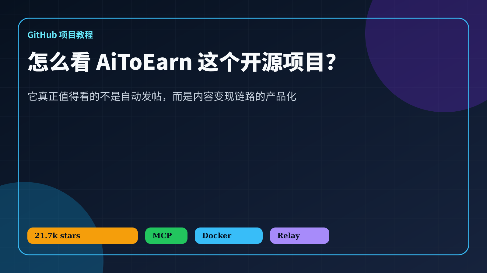
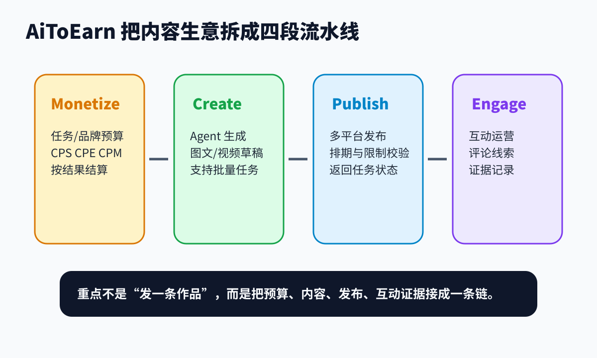
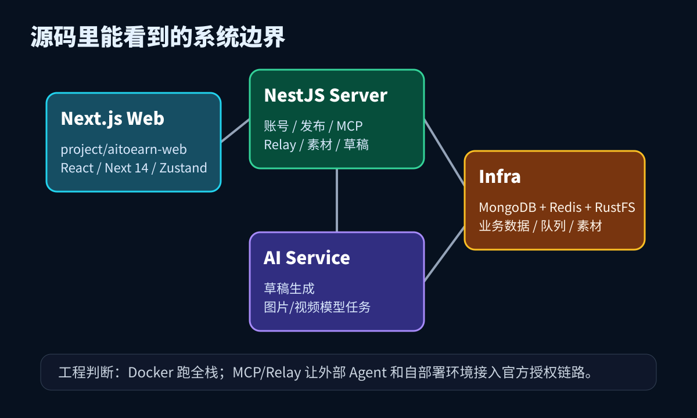
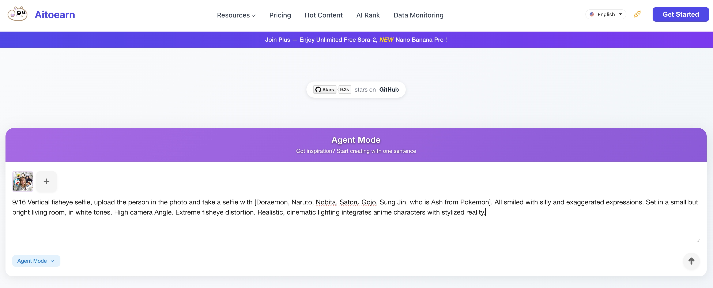
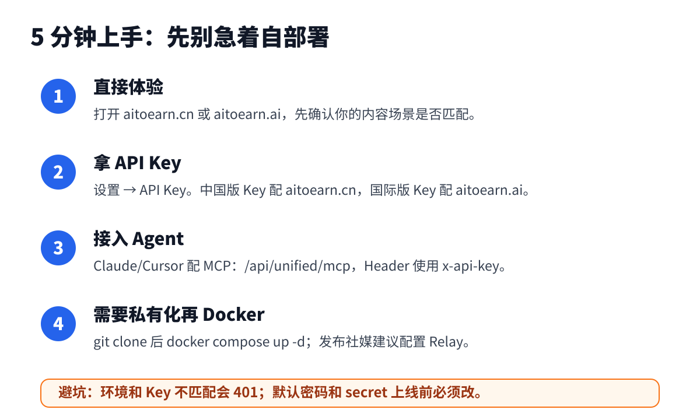

# AiToEarn：不是自动发帖脚本，而是一套 AI 内容变现工作台

很多人第一次看到 [AiToEarn](https://github.com/yikart/AiToEarn) 这个名字，会下意识把它理解成“AI 帮我自动发帖赚钱”。

这个理解只对了一小半。

我把它的 README、Docker Compose、前后端 package 和几个 MCP Controller 看了一遍，真正让我停下来的不是“能发多少平台”，而是它把内容生意拆成了四件事：先找到变现任务，再生成草稿，然后按平台规则发布，最后把互动运营和证据记录接回来。

如果你只想找一个定时发微博的小脚本，AiToEarn 可能太重了。但如果你做的是多平台内容矩阵、品牌任务、达人投放，或者想让 Agent 接手一部分内容运营流程，它就值得认真看。



我本地调研的是 `yikart/AiToEarn` 的 `main` 分支提交 `e88aa14`。GitHub API 显示项目约 21.7k stars、3.2k forks，主语言 TypeScript，MIT License。下面不是 README 翻译，而是按“它到底解决什么问题、怎么跑、边界在哪里”来拆。

## 1. 它解决的不是“发一条内容”，而是“内容变现链路太碎”

做内容运营最烦的地方不在写一条文案，而在链路断得厉害。

你可能在一个平台接品牌任务，在另一个表格里记录预算和结算方式，用 ChatGPT 写草稿，再切到小红书、B 站、TikTok、公众号分别发。发完还要回头看评论、截图、转化线索和交付证据。

这不是一个“写作问题”，而是工作流问题。



AiToEarn 的 README 把自己放在 `Monetize · Publish · Engage · Create` 这四个词上。顺序看起来有点反常，通常工具会先讲“创作”，它先讲“Monetize”。这其实说明了项目的野心：它不想只做内容生成器，而是想从任务、预算、草稿、发布、互动证据一起管。

我更愿意这样理解它：

```text
Monetize：找到任务、预算、结算方式
Create：用 Agent 生成图文/视频草稿
Publish：按平台限制发布并追踪任务状态
Engage：处理互动、评论线索和证据记录
```

这里的关键点不是“AI 写得多快”，而是内容从商业目标到平台交付之间少掉多少手工搬运。

## 2. 源码看下来，它不是单页 Demo

AiToEarn 的仓库不是一个轻量脚本。根目录有 Docker Compose，下面分前端、后端、AI 服务和基础设施。



从我看的文件看，主要结构是这样：

- `project/aitoearn-web`：Next 14、React 18、Zustand、Ant Design、TipTap/Lexical、ECharts、Playwright；
- `project/aitoearn-backend`：Nx + NestJS 风格的后端服务，包含账号、渠道、发布、素材、草稿、MCP 等模块；
- `docker-compose.yml`：MongoDB、Redis、RustFS、初始化服务、`aitoearn-ai`、`aitoearn-server`、Web；
- `presentation/`：项目展示图和截图，能看到 Agent Mode、数据中心、渠道页等界面。

这类结构说明一件事：AiToEarn 的复杂度不在“调用一个模型生成文字”，而在把内容运营里的对象都建出来。账号、素材、草稿、发布任务、平台规则、互动都要有自己的位置。

我最关注的是 MCP 相关源码。`unified-mcp.module.ts` 里能看到：

```ts
McpModule.forRoot({
  name: 'aitoearn',
  version: '1.0.0',
  apiPrefix: 'unified',
})
```

它把能力通过 `/api/unified/mcp` 这一类入口暴露出来。README 里也给了两个 MCP 地址：

```text
https://aitoearn.cn/api/unified/mcp
https://aitoearn.ai/api/unified/mcp
```

国内版和国际版 API Key 不能混用。README 里写得很直白：如果 `aitoearn.cn` 和 `aitoearn.ai` 的 Key/域名不匹配，会 401。这个细节一定要记住，不然排错时很容易怀疑是 Claude、Cursor 或 MCP 客户端的问题。

## 3. 最值得看的源码：平台发布不是裸发文本

我建议直接看 `publish.mcp.controller.ts`。

这里不是只有一个“把 content POST 到平台”的接口，而是把平台限制也做进了工具层。源码里维护了不同平台的发布规则，例如：

- YouTube 标题最多 100 字符；
- TikTok 描述最多 2200 字符；
- Twitter/X 描述最多 280 字符；
- 小红书图片最多 9 张；
- 不同平台对 title、description、thumbUrl、accountId、videoUrl、images 等字段要求不同。

它还暴露了多个发布工具：Bilibili、微信公众号、YouTube、Pinterest、Threads、TikTok、Facebook、Instagram、Kwai、Twitter 等。

这点很重要。很多“多平台发布”原型只是把同一段内容复制到多个地方，失败了再说。AiToEarn 至少在设计上承认一件事：平台之间的约束不一样，发布前就应该让 Agent 知道边界。

这会改变 Agent 的工作方式。

差的方式是：

```text
请把这篇文章发到所有平台。
```

更可靠的方式是：

```text
先查询目标平台限制。
按平台生成标题、正文、封面和图片数量。
发布后返回任务状态。
失败时把原因写回草稿或任务记录。
```

AiToEarn 的 MCP 控制器就在往这个方向做。

## 4. 内容、草稿、账号也通过 MCP 暴露

除了发布，我还看了几个 controller。

`content.mcp.controller.ts` 里有素材组、素材、草稿组、草稿的创建和查询工具，例如 `createMedia`、`createMaterial`、`listDrafts`、`getDraftDetail`、`deleteDraft`、`listMedia`。`getDraftDetail` 里还会校验当前用户，避免跨用户读草稿。

`draft-generation.mcp.controller.ts` 里能看到图文和视频草稿生成相关工具，比如 `createVideoDraft`、`createImageTextDraft`、`getDraftTaskStatus`、`getDraftGenerationPricing`。

`account.mcp.controller.ts` 负责账号列表和授权相关能力。一个值得肯定的小细节是，它返回账号列表时会 omit 掉 `loginCookie`、`access_token`、`refresh_token`、`token` 等字段。这不代表整个系统没有安全风险，但至少说明作者知道这些字段不能随手暴露给 Agent。

这些模块放在一起，就不是“AI 生成文案”那么简单了。它更像一个内容运营后台，被 MCP 包成 Agent 能调用的工具箱。



## 5. 5 分钟上手：先别急着自部署

AiToEarn 的入口有好几种。我的建议是先用低成本方式体验，再决定要不要私有化。



### 路线 A：直接用官网和 API Key

如果只是试功能，README 推荐直接访问：

```text
https://aitoearn.cn
https://aitoearn.ai
```

拿到 API Key 后，再接 MCP：

```text
https://aitoearn.cn/api/unified/mcp
https://aitoearn.ai/api/unified/mcp
```

注意域名和 Key 要匹配。中国版 Key 配中国版地址，国际版 Key 配国际版地址。

### 路线 B：接 Claude、Cursor 或其他 MCP 客户端

README 里给的是 MCP/SSE 地址。实际配置时，你可以把 AiToEarn 当成一个远端 MCP 服务，让 Agent 调用账号、素材、草稿和发布工具。

这个模式适合先验证“Agent 参与内容运营”的感觉，不需要一开始就把整套服务部署到自己机器上。

### 路线 C：用 OpenClaw 插件

README 里给了插件安装命令：

```bash
npx -y @aitoearn/openclaw-plugin-cli
```

如果你的工作流已经在 OpenClaw 或类似 Agent 工作台里，这条路线会更顺。

### 路线 D：Docker Compose 自部署

如果你要看完整系统，README 给的启动方式很直接：

```bash
git clone https://github.com/yikart/AiToEarn.git
cd AiToEarn
docker compose up -d
```

默认访问：

```text
http://localhost:8080
```

但这里不要太乐观。`docker-compose.yml` 里有 MongoDB、Redis、RustFS、AI 服务、后端服务、Web 和初始化服务。它能说明项目完整，但也意味着你要处理端口、存储、模型 API、社媒授权、Relay、回调地址和生产环境密码。

我没有在本地执行 `docker compose up -d`。原因很简单：这会拉起一组服务，并可能涉及模型或平台 API 配置。对教程调研来说，读 README、compose、package 和源码已经足够确认架构；真要上线，还得单独做一次部署检查。

## 6. Relay 是自部署时绕不开的一环

社媒平台 OAuth 很麻烦。每个平台都要开发者账号、应用审核、回调域名、权限申请。AiToEarn 的自部署方案里有一组 Relay 配置：

```text
RELAY_SERVER_URL
RELAY_API_KEY
RELAY_CALLBACK_URL
```

README 对 Relay 的解释大意是：自部署实例可以借助官方 Relay 来处理社媒授权链路。源码里 `RelayClientService` 也会处理 `RelayServerUnavailable` 和 `Relay API returned error` 这类异常。

这不是一个可有可无的细节。很多人一看到 Docker Compose 就以为“本地跑起来 = 全部功能可用”，但社媒发布工具不是这样。页面能打开，只代表服务启动了；账号授权、平台回调、发布权限、IP/域名配置、模型 Key 才是后面的硬骨头。

如果要生产使用，我会先列一张检查表：

| 项目 | 要确认什么 |
| --- | --- |
| API Key | `.cn` 和 `.ai` 域名是否匹配 |
| 模型配置 | OpenAI/Anthropic 或兼容接口是否可用 |
| Relay | Relay URL、Key、Callback 是否正确 |
| 社媒账号 | 每个平台是否已授权，权限是否足够 |
| 存储 | RustFS/Mongo/Redis 是否有持久化和备份 |
| 密码 | Compose 默认密码、secret 是否已全部替换 |
| 发布限制 | 每个平台标题、正文、图片、视频限制是否提前校验 |

## 7. 谁适合用，谁先别急

我会把 AiToEarn 的适用人群分成三类。

第一类是多平台内容运营者。你已经在小红书、B站、抖音、YouTube、公众号、X/Twitter 等平台之间来回切，真正痛点是发布、复用、互动和交付证据。AiToEarn 的方向对你很准。

第二类是想做 Agent 工具链的人。它的 MCP 设计值得看：账号、内容、草稿、发布、互动都可以变成工具，而不是只给 Agent 一个“写文章”的文本框。

第三类是品牌或团队。你关心的是预算、达人任务、CPS/CPE/CPM、结果结算和交付记录。AiToEarn 把 Monetize 放在前面，对这类场景更友好。

但如果你只是个人偶尔发几条内容，或者只想找一个开箱即用的排程工具，AiToEarn 可能会显得重。它更像工作台，不像浏览器插件。

## 8. 我的判断：价值在“对象建模”，不是一句 AI 口号

AI 内容工具最容易把自己讲空：提高效率、降低门槛、释放创造力。听多了以后，基本等于没说。

AiToEarn 比较有意思的地方，是它把内容运营里的对象显式建出来：账号、素材、草稿、平台限制、发布任务、互动证据、变现任务。这些东西一旦被建模，Agent 才有机会稳定地接手一部分工作。

它当然还需要继续验证。比如自部署的稳定性、Relay 的可用性、各平台发布成功率、授权异常处理、成本控制和账号风控，都不是看 README 就能下结论的。

但至少从源码结构看，它不是“套壳自动发帖”。它在尝试把内容变现链路产品化。

如果你想研究 AI Agent 怎么从“聊天”走向“执行业务流程”，AiToEarn 是一个值得拆的样本。
