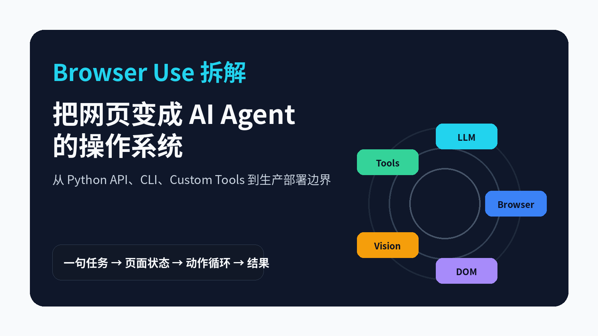
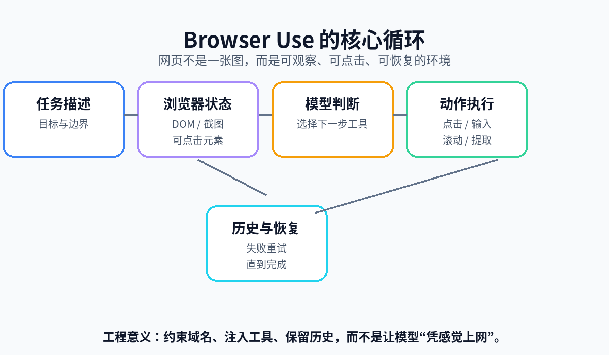
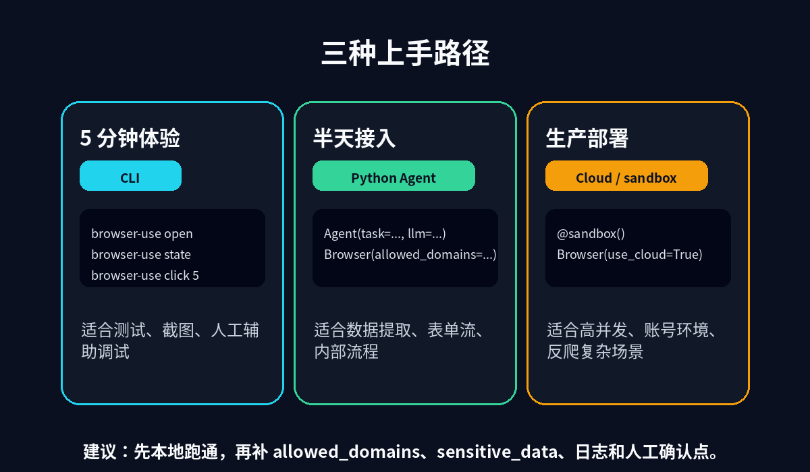
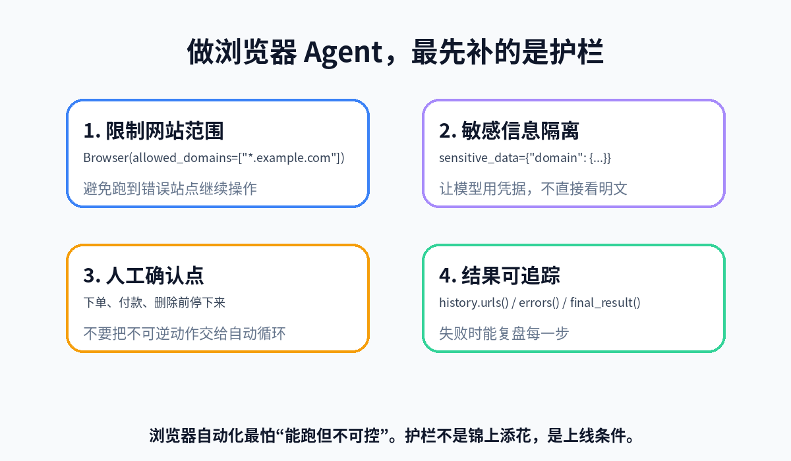
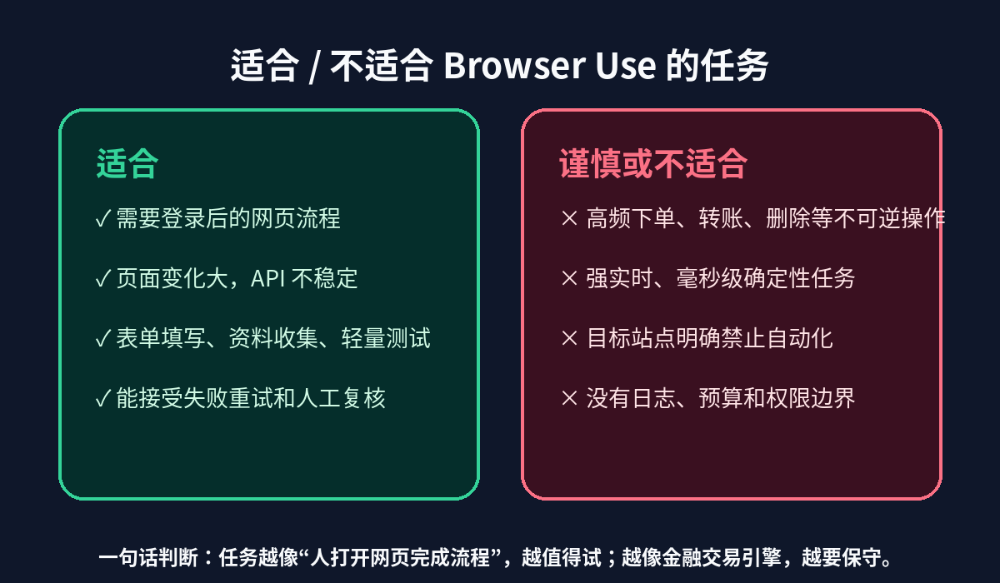

# Browser Use：让 AI 真的打开网页、点击按钮、填写表单

很多人第一次做网页自动化，都会先想到 Playwright、Selenium，或者直接让大模型“读取网页内容”。这两条路都没错，但它们各有一个硬伤。

传统自动化很稳定，却要求你提前写好选择器、等待条件和异常分支。网页一改版，脚本就断。让大模型读网页更灵活，但它如果只能看文本，遇到登录、弹窗、分页、动态表单和上传文件，很快就变成“嘴上会，手不会”。

[Browser Use](https://github.com/browser-use/browser-use) 做的是中间那层：给 AI Agent 一个真正的浏览器，让它能观察页面状态、点击按钮、输入文本、滚动、上传文件、提取内容，并把每一步留在执行历史里。它不是“再写一段爬虫”，而是把网页变成 Agent 可以操作的环境。



我本地调研的是 `browser-use/browser-use` 的 `main` 分支提交 `48c3c88`，最近一次提交信息是 `add qa skill (#5074)`。GitHub API 显示项目约 100k stars、11.1k forks，MIT License，主语言 Python。`pyproject.toml` 中当前版本为 `0.13.2`，要求 Python `>=3.11,<4.0`，并提供 `browser-use`、`bu`、`browser` 等 CLI 入口。

下面不是 README 翻译，而是按“它解决什么问题、怎么上手、上线前要补哪些护栏”来拆。

## 1. 它解决的不是爬网页，而是让 Agent 能操作网页

Browser Use 的一句话描述是：`Make websites accessible for AI agents`。

这句话很关键。它的目标不是替代所有 Playwright 脚本，也不是把网页内容转成 Markdown 后丢给模型。它更像一个“浏览器操作层”：每一步把页面状态交给模型，模型选择工具，工具再去点击、输入、滚动、提取，直到任务完成。



这个循环在源码和文档里对应得很清楚：

```python
from browser_use import Agent, ChatBrowserUse

agent = Agent(
    task="Search for latest news about AI",
    llm=ChatBrowserUse(),
)
history = await agent.run(max_steps=500)
print(history.final_result())
```

`Agent.run()` 返回的是 `AgentHistoryList`，你可以拿到访问过的 URL、截图路径、执行过的动作、错误、最终结果和结构化输出。这一点比“让模型浏览一下网页然后给结论”可靠得多，因为失败时你能复盘它到底点了哪里、卡在哪一步。

差的用法是：

```text
帮我去网上找资料，顺便整理成表格。
```

更好的用法是：

```text
1. 打开指定网站。
2. 只在 example.com 域名内操作。
3. 搜索关键词 X。
4. 提取前 10 条结果的标题、URL、发布时间。
5. 如果遇到登录或付费墙，停止并说明原因。
```

浏览器 Agent 的成败，很多时候不取决于模型有多聪明，而取决于任务有没有边界。

## 2. 三种上手路径：CLI、Python、生产部署

Browser Use 的文档里有两条主线：一条是给人快速操作浏览器的 CLI，一条是给工程项目集成的 Python API。再往后，是 Browser Use Cloud 和 `@sandbox` 这种生产部署方式。



### 5 分钟体验：先用 CLI 看清页面状态

README 和 CLI 文档都给了很短的命令：

```bash
# 安装包与浏览器运行时
uv add "browser-use[core]"
# 或 pip install "browser-use[core]"

# 启动命令行浏览器
browser

# 常用 CLI
browser-use open https://example.com
browser-use state
browser-use click 5
browser-use type "Hello"
browser-use screenshot page.png
browser-use close
```

`browser-use state` 会返回当前页面可点击元素及其索引。这个设计很适合调试：你先看页面上有哪些元素，再决定点击哪个索引，而不是一上来就写脆弱的 CSS selector。

如果你在做登录态任务，CLI 文档还提供了几种浏览器模式：

```bash
browser-use --headed open https://example.com
browser-use --profile "Default" open https://gmail.com
browser-use --cdp-url http://localhost:9222 open https://example.com
browser-use cloud connect
```

这里要注意：使用真实 Chrome profile 意味着能带上登录态，也意味着更高的权限风险。不要在没有边界的任务里直接交出常用账号环境。

### 半天接入：Python Agent + 浏览器边界

Python API 的最小例子很短：

```python
from browser_use import Agent, ChatBrowserUse
from dotenv import load_dotenv
import asyncio

load_dotenv()

async def main():
    llm = ChatBrowserUse()
    agent = Agent(
        task="Find the number 1 post on Show HN",
        llm=llm,
    )
    history = await agent.run()
    print(history.final_result())

asyncio.run(main())
```

如果你想用其他模型，文档也给了 `ChatOpenAI`、`ChatAnthropic`、`ChatGoogle` 等示例。项目的 `pyproject.toml` 里也能看到 OpenAI、Anthropic、Google、Groq、Ollama、MCP 等依赖或集成痕迹。

但我不建议一开始就追求“模型全兼容”。先把浏览器边界补上：

```python
from browser_use import Agent, Browser, ChatBrowserUse

browser = Browser(
    headless=False,
    allowed_domains=["*.github.com"],
)

agent = Agent(
    task="Find the number of stars of the browser-use repo",
    llm=ChatBrowserUse(),
    browser=browser,
)
```

`allowed_domains` 是非常实用的参数。它能把 Agent 限制在指定域名内，避免任务跑偏后继续点击未知网站。

### 生产部署：不要忽略 Cloud / sandbox 的现实价值

很多开源项目一碰生产就尴尬：本地能跑，服务器上浏览器、代理、验证码、登录态、视频记录、并发和资源回收全是坑。

Browser Use README 把这个问题摆得很直接：开源 Agent 适合自定义工具、代码级集成和自托管；Cloud Agent 更适合复杂任务、扩容、代理轮换、验证码处理、持久文件系统和账号环境。

生产示例大概长这样：

```python
from browser_use import Browser, sandbox, ChatBrowserUse
from browser_use.agent.service import Agent
import asyncio

@sandbox(cloud_profile_id='your-profile-id')
async def production_task(browser: Browser):
    agent = Agent(
        task="Your authenticated task",
        browser=browser,
        llm=ChatBrowserUse(),
    )
    await agent.run()

asyncio.run(production_task())
```

这不是说你必须用它的云服务。更准确的判断是：如果你的任务需要登录态、代理、反爬绕过、远程可视化和稳定运行，浏览器基础设施会变成主要成本。你要么自己搭，要么买现成的。

## 3. 真正有工程味的部分：Custom Tools、敏感数据、历史记录

Browser Use 最值得看的，不是“模型能点网页”这件事本身，而是它给 Agent 留了工程接口。

比如自定义工具：

```python
from browser_use import Tools, ActionResult, BrowserSession

tools = Tools()

@tools.action('Ask human for help with a question')
async def ask_human(question: str, browser_session: BrowserSession) -> ActionResult:
    answer = input(f'{question} > ')
    return ActionResult(extracted_content=f'The human responded with: {answer}')
```

文档里有一个容易踩坑的细节：参数名必须叫 `browser_session: BrowserSession`，因为注入是按名字匹配的。写成 `browser` 可能会静默失败。这种细节说明它不是纯概念项目，而是真的把工具注入、浏览器会话、文件系统和动作结果当成一套 Agent runtime 在设计。

它的默认工具覆盖也比较完整：搜索、导航、后退、等待、点击、输入、上传文件、滚动、查找文本、发送键盘、执行 JavaScript、切换/关闭 Tab、LLM 提取、截图、下拉框、文件读写，以及 `done`。

对企业或个人账号自动化来说，敏感数据处理更重要。示例里有这样的写法：

```python
sensitive_data = {
    'httpbin.org': {
        'telephone': '9123456789',
        'email': 'user@example.com',
        'name': 'John Doe',
    }
}

agent = Agent(
    task='Go to https://httpbin.org/forms/post and put the secure information in the relevant fields.',
    llm=llm,
    sensitive_data=sensitive_data,
)
```

思路是：让 Agent 能使用受控数据，但不要把所有明文凭据随便暴露给模型。上线时还要配合域名限制、日志脱敏、人工确认点和最小权限账号。



## 4. 一个可复制的小例子：只在 GitHub 内找项目信息

假设你想做一个“开源项目资料卡片生成器”：打开 GitHub 仓库，提取 stars、license、README 第一段、最近提交信息，并输出 Markdown。

不要一上来让 Agent “全网搜索”。先把边界写死：

```python
from browser_use import Agent, Browser, ChatBrowserUse
import asyncio

async def main():
    browser = Browser(
        headless=False,
        allowed_domains=["*.github.com"],
    )

    agent = Agent(
        task="""
        打开 https://github.com/browser-use/browser-use。
        只在 github.com 域名内操作。
        提取：项目名称、stars、forks、license、README 中的快速上手命令。
        如果页面没有出现某个字段，就写“未在页面上看到”，不要猜。
        最后用 Markdown 表格输出。
        """,
        llm=ChatBrowserUse(),
        browser=browser,
        max_failures=3,
    )

    history = await agent.run(max_steps=30)
    print(history.final_result())

asyncio.run(main())
```

这个例子看起来普通，但里面有几个上线前很重要的习惯：

- `allowed_domains` 限制操作范围。
- 任务里要求“看不到就说看不到”，减少幻觉。
- `max_steps` 和 `max_failures` 控制成本和死循环。
- 用 `history.final_result()` 拿最终结果，失败时还能看 `history.errors()` 和 `history.urls()`。

如果要扩展成内部工具，可以再加自定义保存动作，把结果写到数据库或发到 Slack。但下单、付款、删除、发送邮件这类不可逆动作，应该加人工确认。

## 5. 它适合谁，不适合谁

Browser Use 很适合这几类场景：



第一类是登录后的网页流程。比如后台系统录入、CRM 查询、报表下载、招聘网站投递、供应商页面检查。这些任务通常没有稳定 API，但人可以通过网页完成。

第二类是页面结构变化比较频繁的资料提取。传统 selector 脚本一改版就断，Agent 至少有机会通过页面语义和截图恢复。

第三类是轻量 QA。项目里甚至有 `skills/qa`，说明 Browser Use 团队也在把“像人一样检查网页”当作一个重要方向。

但它不适合把一切都自动化。

如果任务要求毫秒级确定性，传统脚本或 API 更合适。如果任务涉及转账、下单、删除数据、群发消息，你至少要加人工确认和审计日志。如果目标网站明确禁止自动化，技术上能跑也不代表可以跑。

还有成本问题。浏览器 Agent 的每一步都可能调用模型。页面复杂、步骤多、失败重试多，账单会很快变难看。生产里应该记录步数、耗时、模型成本、失败率，而不是只看“跑通了没”。

## 6. 上线前检查清单

我会按这个顺序评估 Browser Use 项目：

```text
1. 任务是否真的需要浏览器？有 API 就优先用 API。
2. 是否能限制域名？不能限制的任务先不要自动执行。
3. 是否有不可逆动作？有就加人工确认。
4. 是否需要登录态？优先用低权限账号和独立 profile。
5. 是否有敏感数据？用 sensitive_data、环境变量或密钥管理，不写进 prompt。
6. 是否能复盘？保存 history、截图、错误和最终输出。
7. 是否有预算上限？限制 max_steps、max_failures 和运行频率。
```

一句话总结：Browser Use 的价值，不是让 AI “看懂网页”，而是让 AI 在可控边界内操作网页。

如果你只是抓一个公开列表，别上 Agent，写个 API 或爬虫更稳。如果你面对的是登录后的复杂网页、反复变化的 UI、需要人手点来点去的流程，Browser Use 值得认真试一次。
