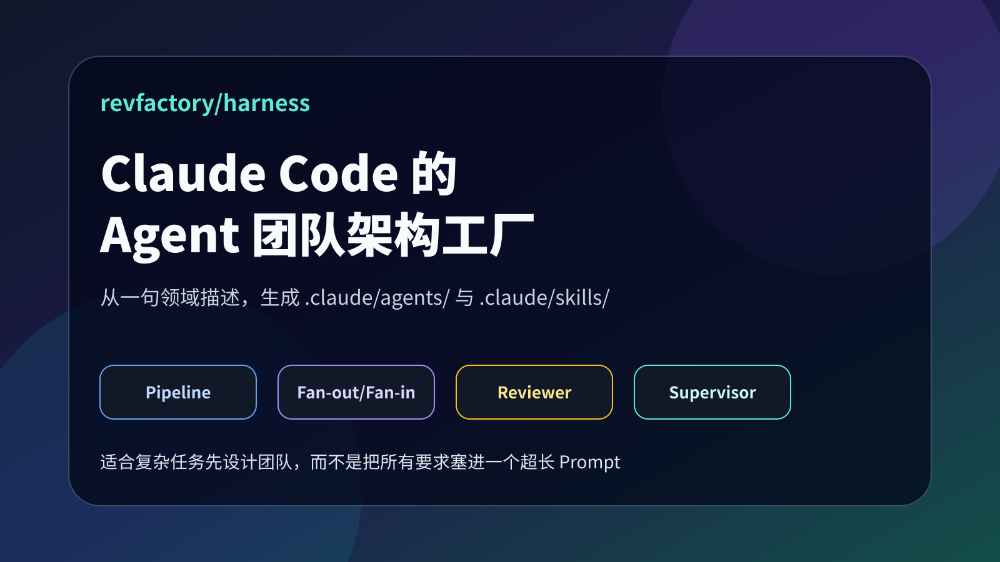
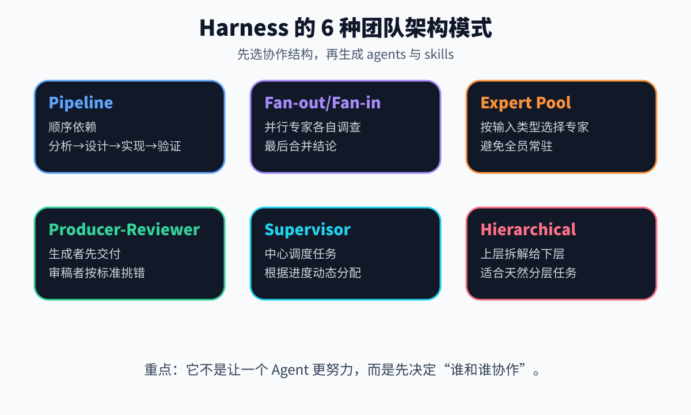
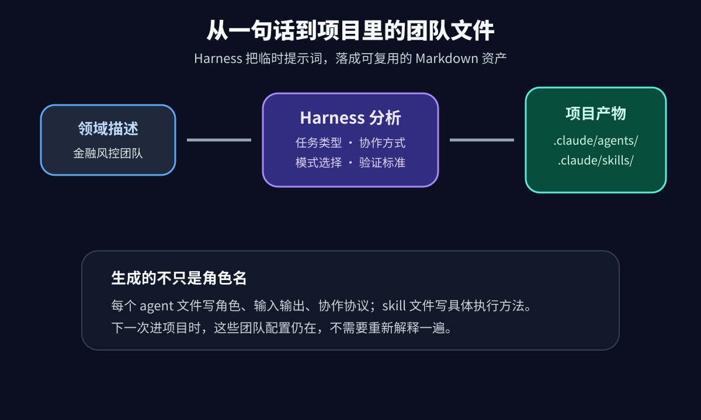
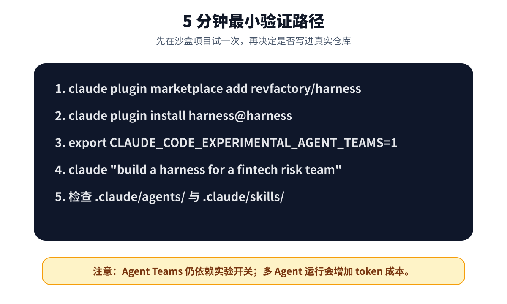
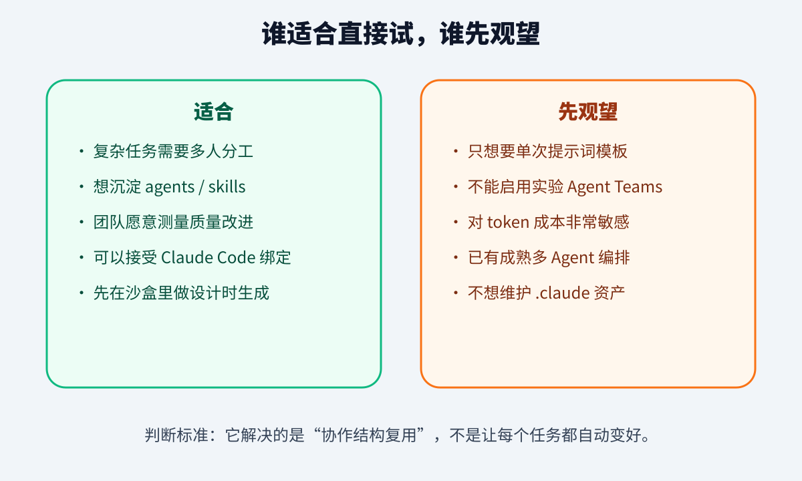

# Harness：用一句话生成 Claude Code 的 Agent 团队

很多团队第一次用 AI 写代码，都会走到同一个尴尬点：提示词越写越长，Agent 的角色越来越多，但这些东西只存在聊天记录里。

今天让它做架构师，明天让它做 reviewer，后天又让它当测试工程师。每次都要重新解释背景、分工、输出格式和验收标准。项目一复杂，所谓“多 Agent 协作”就变成了人肉调度。

[revfactory/harness](https://github.com/revfactory/harness) 解决的不是“再给你一组万能 Prompt”，而是把团队结构写进项目。你给它一句领域描述，它在 Claude Code 项目里生成 `.claude/agents/` 和 `.claude/skills/`，让不同 Agent 有自己的角色、协作协议和执行方法。



我本地调研的是 `revfactory/harness` 的 `main` 分支提交 `cceac68`。GitHub API 显示项目约 7.1k stars、998 forks，Apache-2.0 License，仓库主语言显示为 HTML。下面不是 README 翻译，而是按“它到底解决什么、怎么用、风险在哪里”来拆。

## 1. 它不是 Prompt 合集，而是团队架构工厂

Harness 在 README 里的自我定位很直接：`The Team-Architecture Factory for Claude Code`。

这句话比“多 Agent 工具”更准确。

普通 Prompt 合集解决的是一句话怎么写。Harness 解决的是：一个复杂任务里，应该有哪些角色，它们怎么分工，谁先做，谁复核，哪些工作适合并行，哪些工作必须顺序推进。

它预置了 6 种团队架构模式：



这 6 种模式覆盖了常见的 AI 工作流：

```text
Pipeline：顺序依赖任务，例如分析 → 设计 → 实现 → 验证
Fan-out/Fan-in：多个专家并行调查，最后汇总
Expert Pool：根据输入类型选择合适专家
Producer-Reviewer：生成者交付，审稿者按标准检查
Supervisor：中心角色动态分配任务
Hierarchical Delegation：上层拆解，下层执行
```

这背后的判断很实用：很多失败的 Agent 项目，不是模型不会回答，而是团队结构没设计。你把研究、实现、测试、安全审查、文档全部塞给一个 Agent，它当然容易漏东西。

差的做法是：

```text
你是一个资深全栈工程师、架构师、安全专家、测试专家和文档专家，请帮我完成这个项目。
```

更好的做法是：

```text
先把任务拆成架构、实现、QA、文档几个角色。
每个角色有输入、输出、协作协议和验收标准。
需要并行的并行，需要复核的复核。
```

Harness 想把后一种做法变成项目资产，而不是每次重新口述。

## 2. 它实际会生成什么

README 和 quickstart 都写得很清楚：安装后，在 Claude Code 里说类似下面的话：

```bash
claude "build a harness for a fintech risk-assessment team"
```

Harness 会根据你的领域描述生成两类目录：

```text
your-project/
└── .claude/
    ├── agents/
    │   ├── analyst.md
    │   ├── builder.md
    │   └── qa.md
    └── skills/
        ├── analyze/
        │   └── SKILL.md
        └── build/
            ├── SKILL.md
            └── references/
```



我看了 `skills/harness/SKILL.md`，它不是简单让模型“自由发挥”。里面有一套比较明确的流程：

- Phase 0：先审计项目里已有的 `.claude/agents/`、`.claude/skills/` 和 `CLAUDE.md`，避免重复造角色；
- Phase 1：分析领域和任务类型；
- Phase 2：选择团队架构模式；
- Phase 3：生成 agent 定义；
- Phase 4：生成 skill；
- Phase 5：把团队组织起来，写清楚数据怎么传、错误怎么处理；
- Phase 6：验证与测试。

这里有个细节值得注意：Harness 强调 agent 和 skill 分开。

Agent 回答“谁来做”：架构师、实现者、QA、研究员。Skill 回答“怎么做”：如何审查 API shape，如何写测试，如何抽取资料，如何输出检查表。

这比把所有规则都塞进一个长 Prompt 更利于维护。一个角色可以换技能，一个技能也可以被多个角色复用。

## 3. 最小上手路径

Quickstart 给出的目标是 5 分钟跑通。前置条件是 Claude Code v2.x 或更高，能访问 GitHub 和 Anthropic API，并且要启用 Agent Teams 实验开关。



按 quickstart 的写法，命令大概是：

```bash
claude plugin marketplace add revfactory/harness
claude plugin install harness@harness
export CLAUDE_CODE_EXPERIMENTAL_AGENT_TEAMS=1
claude "build a harness for a fintech risk-assessment team"
```

README 里也保留了 Claude Code 内部 slash command 风格的写法：

```text
/plugin marketplace add revfactory/harness
/plugin install harness@harness-marketplace
```

如果你本地 Claude Code 版本不同，两种命令可能表现不一样。我的建议是：先按 `docs/quickstart.md` 里的 CLI 命令执行；如果插件没有出现在列表里，再用 `claude plugin list`、`claude plugin enable harness@harness` 检查状态。

生成后至少做两件事：

```bash
ls -la .claude/agents/
ls -la .claude/skills/
```

然后丢一个真实任务给它，而不是只看文件是否存在。比如 README 里的金融风控例子：让团队对一个中型制造企业的 500 万美元授信申请做一页风险评估，覆盖信用历史、行业集中度和监管风险。

这个例子好在足够复杂。只有复杂任务，才能看出“团队结构”是不是有价值。

## 4. 它最值得看的工程点：把协作规则文件化

很多多 Agent Demo 的问题是，运行时看起来热闹，结束后什么也没留下。下次要复现同样的工作流，还得靠人记得上次怎么分工。

Harness 的产物是 Markdown 文件。这一点朴素，但很关键。

`.claude/agents/<name>.md` 里应该写角色、工作原则、输入输出协议、错误处理、团队通信协议；`.claude/skills/<name>/SKILL.md` 里写具体执行步骤和可选 reference。`CLAUDE.md` 只留下触发规则和变更记录，不把所有细节堆进去。

这是一种很现实的工程取舍：

```text
聊天记录：适合探索，但不可维护
单个超长 Prompt：能跑一次，但容易漂移
项目内 agents/skills：可审查、可提交、可迭代
```

从团队管理角度看，Harness 更像“AI 团队脚手架”。它的价值不是第一次生成有多惊艳，而是后续能不能被审查、修改、复用。

## 5. 先别忽略边界：实验开关、成本和运行时绑定

Harness 不是所有人都应该立刻上生产。

README 和 `docs/experimental-dependency.md` 都写明了一个现实限制：它依赖 Claude Code 的 Agent Teams API，涉及 `TeamCreate`、`SendMessage`、`TaskCreate`，当前需要：

```bash
export CLAUDE_CODE_EXPERIMENTAL_AGENT_TEAMS=1
```

文档也解释了：如果这个变量没设置，团队模式可能退回单 Agent 执行，Pipeline、Fan-out/Fan-in、Supervisor、Hierarchical Delegation 这些模式会失真。

还有成本问题。Quickstart 的失败 FAQ 里直接提醒：一个复杂任务可能触发 5 个以上并行 Claude 调用，单个任务消耗 50K 到 200K tokens 并不奇怪。

所以我不会建议一上来就在主仓库大规模生成。更稳的路径是：

1. 新建一个沙盒项目；
2. 用一个真实但低风险的任务生成 harness；
3. 检查 `.claude/agents/` 和 `.claude/skills/` 是否合理；
4. 跑 2 到 3 个任务，对比没有 harness 时的结果；
5. 只有当质量提升可观察，再把生成资产迁入真实仓库。



## 6. 一个可复制的试用清单

如果你准备试 Harness，我建议按下面这张清单判断，不要只看 GitHub stars。

```text
适合直接试：
- 任务天然需要多个角色，例如研究、实现、QA、文档、安全审查；
- 你希望把 Agent 分工沉淀在仓库里，而不是每次重写 Prompt；
- 团队愿意花时间审查生成的 agents 和 skills；
- 能接受 Claude Code 绑定和 Agent Teams 实验开关；
- 有预算跑几轮 A/B，对比输出质量。

先观望：
- 你只是想要一份提示词模板；
- 公司不允许启用 experimental flag；
- 你对 token 成本非常敏感；
- 你已经有 LangGraph、CrewAI 或内部多 Agent 编排；
- 你不想维护 .claude 目录里的长期资产。
```

官方 README 提到了一个作者测量的 A/B 结果：在 sister repo `revfactory/claude-code-harness` 的 15 个软件工程任务中，带 Harness 的平均质量分从 49.5 到 79.3，约 +60%，15/15 win-rate，方差降低 32%。这组数据值得关注，但要按 README 自己的说法理解：这是作者测量，样本 n=15，仍等待第三方复现。

我更看重的是它的工程方向：把“我想让 AI 团队怎么协作”变成可以提交到仓库的文件，而不是藏在某次对话里。

如果你正在做 Claude Code 工作流、AI coding agent 规范化，或者想把团队经验沉淀成 agents/skills，Harness 值得拆。它不是万能自动化按钮，但它提出了一个更成熟的问题：在让 Agent 干活之前，我们是不是应该先设计团队？
